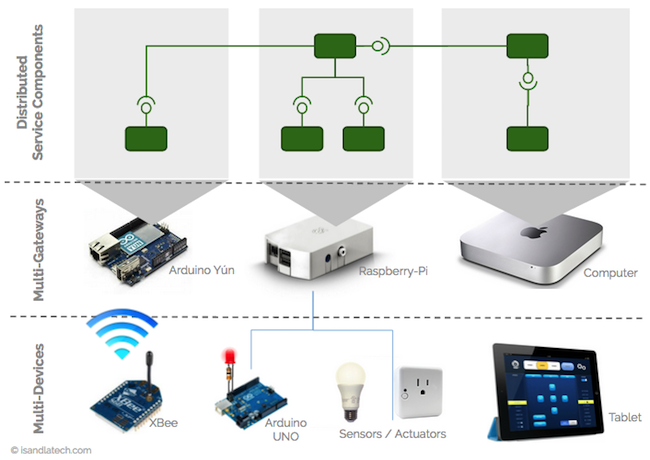

In this white paper, we show you how COHORTE could be used in the Internet of Things area with high added values.

## Vision

 
 
 

 * `Architects are happy`
   * IoT application is seen as a set of Service-oriented Components from devices to cloud.

 * `Developers are happy`
   * Cohorte is based on an implementation of OSGi specification for Java and Python programming languages.
   * They implement business code, not distribution and life-cyle management tasks.

 * `Operators are happy`
   * Cohorte provides Remotes Services between components (Java or Python) with zero configurations.
   * It supports multi-gateway deployement for more scalability and fine grain control.

## Value added of COHORTE

 * **Security** : 
   * communication between gateways is secured
   * we can not integrate other gateways if we have not the same APPLICATION's ID! 

 * **Efficiency** :
   * *Zero Config* : no need for complicated configurations to get gateways (and components) working together
   * *Local data processing* : data is processed in the gateway of local devices not in centralised server (incremental processing)
   * *Scalability* : multiple gateways in local internet area, or over Internet (including cloud hosted gateways - nodes)

 * **Continuity of service** : 
   * *Resilience* : If one component fails in a gateway, COHORTE tries to isolate it in a separate container (a.k.a isolat) to ensure continuty of service and simplify developers' task to identify faulty components and by then replace them.
   * *Dynamic adaptability* : components can be updated dynamically without stopping the system.

 * **Ease of Development** :
   * *Service-oriented Components approach* : COHORTE application is composed of a set of distributed service-oriented components. The global architecture could be established and documented easly. Components are black boxes, no need for developers to implement complex tasks like using remote services (a.k.a calling remote methods).
   * *Faster time to market* : service-oriented components (drivers, transformers, aggregators, etc) can be capitalised and reused in other projects.

## Where to start

Read the following documentation pages to have a first idea about the project :

 * [Key Concepts]({{ site.baseurl }}/docs/1.x/key-concepts) 

Try the following tutorials :

 * [Temper tutorial]({{ site.baseurl }}/docs/1.x/tutorials/temper) : Highlighting the multi-language and distribution features of COHORTE in a simple, yet functional distributed temperature monitoring application.

 * [Arduino LED tutorial]({{ site.baseurl }}/docs/1.x/tutorials/arduino-led) : How to use COHORTE to export an Arduino micro-controller as a Service used by other components.

 * [Robots tutorial]({{ site.baseurl }}/docs/1.x/tutorials/robots) : How to use COHORTE to build Robots application.