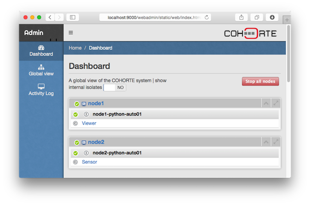
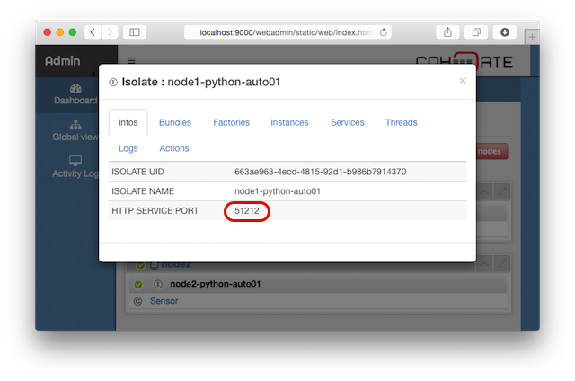

This page presents how to use Cohorte to construct a distributed component-based service-oriented application. 

You should have been already downloaded and installed Cohorte on your system ([more details here](../setup)).

The components are implemented on Python, you should have Python installed on your system (2.7+). Notice that Cohorte also supports Java component-based service-oriented components provided by [Apache Felix iPOJO](http://felix.apache.org/documentation/subprojects/apache-felix-ipojo.html).

Type the following command to ensure that Cohorte is properly installed on your system:


$ cohorte-version

-----------------[ Installed COHORTE distribution ]--------------------

    - distribution : cohorte-macosx-distribution
    - version      : 1.1.0
    - stage        : dev
    - timestamp    : 20150701-233214
    - location     : /Users/debbabi/tools/cohorte

-----------------------------------------------------------------------	



## A simple distributed application

In this getting started tutorial, we will create a simple application consisting of two components deployed on two different nodes.

We have one component A providing a Temperature Service and another component B consuming this service to show the current temperature on a Web page.   

## Creating Cohorte Nodes

We start first by creating Cohorte Nodes that will host the different application components. Cohorte Nodes could be executed on the same physical machine or on different machines. Cohorte supports two protocols for the abstraction of the discovery and communication between nodes: `http` and `xmpp`. Depending on the deployment strategy, you can choose one and/or the two protocols. Http is used on local network areas, while xmpp is prefered to be used for Internet based applications (you need an XMPP server).

To create the two nodes, type the following commands : 

 
$ cohorte-create-node -n node1 -c myapp



$ cohorte-create-node -n node2 


Each of this commands will create a directory containing two sub-directories `repo` and `conf` and two executables `run` and `run.bat` for unix-based and Windows operating systems.

Option `-n` gives a name for the node, while the `-c` option provides a name for the composition (application). It is set only on node1 as we have to write the composition of the application in only one place (Top Composer node).

On each node, there is a generated `conf/run.js` file which provides default startup options ([more information on startup options here](../creating-starting-nodes)). 

## Writting the Composition specification
 
On `node1/conf` directory, update `composition.js` to provide the composition of the application (set of components and their placement).


{
    "name": "myapp",
    "root": {
        "name": "myapp-composition",
        "components": [
            {
                "factory" : "org.example.temperature.Viewer",
                "name"    : "TemperatureViewer",
                "node"    : "node1"
            },
            {
                "factory" : "org.example.temperature.Sensor",
                "name"    : "TemperatureSensor",
                "node"    : "node2"
            }
        ]
    }
} 


We will have two component instances named `TemperatureViewer` and `TemperatureSensor` located on `node1` and `node2` respectively. 
Each component insance will be created using a **Factory** (or **Component Factory**), which is no more than a simple Classes providing and consuming services.
 
## Implementing Service-Oriented Components

To implement the two Component Factories `org.example.temperature.Viewer` and `org.example.temperature.Sensor` we have the choice between :

* Python : using [Coderxpress iPOPO framework](http://ipopo.coderxpress.net/).
* Java : using [Apache Felix iPOJO framework](http://felix.apache.org/documentation/subprojects/apache-felix-ipojo.html). 

In this getting started example, we will use Python programming language. [See this page](../components) for more details about the supported component-based service-oriented frameworks.

* Create a directory `temperature`, and create on it three other files :

`sensor.py` implements `org.example.temperature.Sensor` Component Factory. It has the following content : 


from pelix.ipopo.decorators import ComponentFactory, Provides 
import random

@ComponentFactory("org.example.temperature.Sensor")
@Provides("TemperatureService")
class Sensor(object):
		
    def get_temperature(self):
         return randrange(0, 50)


This component implements `TemperatureService` service which has one method `get_temperature()` that returns, for simplicity, a random number between 0 and 50. 

`viewer.py` implements `org.example.temperature.Viewer` Component Factory. It has the following content : 


from pelix.ipopo.decorators import ComponentFactory, Provides, Requires, Property
import pelix.remote

@ComponentFactory("org.example.temperature.Viewer")
@Provides('pelix.http.servlet')
@Property('path', 'pelix.http.path', "/")
@Property('reject', pelix.remote.PROP_EXPORT_REJECT, ['pelix.http.servlet'])
@Requires("sensor","TemperatureService")
class Viewer(object):
    def __init__(self):
        sensor = None
        path = None
		
    def do_GET(self, request, response):
        temp = sensor.get_temperature()
        result = "<H3>Actual Temperature : {0}</h3>".format(temp)
        response.send_content(200, result, "text/html")


This component requires `TemperatureService` to get sensor's captured temperature. It also provides (implements) the `pelix.http.servlet` which is a standard service provided by the runtime to publish webpages (or servlets). The servlet is binded with the path `/`. The port on which the servlet will be listening for requests is could be configured or left to Cohorte's runtime to affect a random one.

One detail to mention here is the use of `reject` service property to avoid exporting the listed provided services as *Remote Services*. That is, the `pelix.http.servlet` is local service, we should not export it as remote service. All other service are by default exported as *Remote Services*.

## Starting the Nodes

Put `temperature` directory containing the implemented components on the `repo` directory of each of the two nodes (`node1/repo` and `repo2/repo`).

`node1` has `composition.js` on its `conf` directory, we will start it as a Top Composer (responsible for distributing the composition specification to all other nodes).

Go to `node1` directory and type the following command : 


$ ./run --app-id myappid --top-composer true --http-port 9000


`--app-id` option is mandatory and sets the application's identifier that is shared between all the nodes of the application.

`--http-port` sets the port on which we can access the HTTP Service (servlets) of this node.

You should see an output that looks like that : 


   _____ ____  _    _  ____  _____ _______ ______ 
  / ____/ __ \| |  | |/ __ \|  __ \__   __|  ____|
 | |   | |  | | |__| | |  | | |__) | | |  | |__   
 | |   | |  | |  __  | |  | |  _  /  | |  |  __|  
 | |___| |__| | |  | | |__| | | \ \  | |  | |____ 
  \_____\____/|_|  |_|\____/|_|  \_\ |_|  |______|
    

     APPLICATION ID : myappid
          NODE NAME : node1
         TRANSPORTS : http

       TOP COMPOSER : True

          HTTP PORT : 0
         SHELL PORT : 0

   COMPOSITION FILE : composition.js
         AUTO START : True
    

Start the second node by going to `node2` directory and typing the following command (without the `--top-composer` option, by default is false): 


$ ./run --app-id myappid 


## Monitoring the different nodes

Open a web browser with the following address : `http://localhost:9000/webadmin`

This will open the **webadmin** application provided by Cohorte's runtime. It allows you monitoring all the nodes of the application in one place.

 

You notice that we have two nodes (we can re-deploy them on two different machines).
On each node, we have the desired component instances that runs on python **Isolates**.

* Click on `node1-python-auto01` to get detailed information. Figure out *HTTP-PORT* property to get its concret http port on which the HTTP service is accessible.

