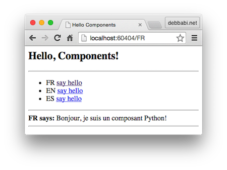

 As a COHORTE user, you need to have Java ( >= 1.6 ) and Python ( >= 3 ) installed on your system. Next, you need to [download]({{site.baseurl}}/downloads) and [install]({{ site.baseurl }}/docs/1.1/setup) COHORTE on your system.
 
 The objective of this getting started tutorial is to get you familiar with COHORTE concepts as quickly as possible. There is no need to start coding at this step. You find other advanced tutorials in the tutorials section of the [documentation page]({{ site.baseurl }}/docs/1.1/).

The following picture depicts the architecture of the to be developed application. It consists of one component `HelloComponents` which requires a set of other components providing **HELLO SERVICE** (`HelloFrench`, `HelloEnglish`, etc). `HelloComponents` component provides a web page that shows the list of available **HELLO SERVICE** providers and allows users to invoke their `say_hello()` and shows the returned message on the web page. 

Hello components (implementing the **HELLO SERVICE**) can be implemented using different programming languages (*Java* and/or *Python*) and can be placed in different remote nodes. Developers have not to worry about this details. COHORTE manages to have all the application components interacts as they where in one place (Using *Remote Services*). 

The remainder of this tutorial is organized in four steps :

 * **[STEP 1](#step1)** : creating a simple application on one node, but two seperate isolates. 
 * **[STEP 2](#step2)** : using two distributed nodes to host the same application (without changing the components implementation code).
 * **[STEP 3](#step3)** : using a mixture of Java and Python components.
 * **[STEP 4](#step4)** : crash-test

## Creating a simple application (one node)

 In this first step of the tutorial, we will instantiate the components `HelloComponents` (**HC**), `HelloEnglish` (**EN**), `HelloFrench` (**FR**), and `HelloSpanish` (**ES**). We want to seperate between **HC** component and other components providing HELLO SERVICE (which can contain third-party non controlled code). COHORTE supports this separation by using **Isolates**. Isolates are a seperate process with all the needed runtime infrastructure allowing the execution of the managed components.

 The following picture depicts the desired resilient architecture. If one of the components providing the HELLO SERVICE fails, there will be no impact on **HC** component! As they are deployed on two seperate containers or isolates (*web* and *components-1*). 

  

### Preparing the execution node

 * Open a new terminal and type the following command on your working directory (check this page for more detail about [creating and starting]({{ site.baseurl }}/docs/1.1/creating_starting_nodes) Cohorte Nodes):

<pre>
$ <b>cohorte-create-node</b> -n node1 -c hello-app
</pre>

This command will create a new directory named `node1` containing an executable `run` (which launches the created COHORTE node) and two folders `conf` (containing configuration files) and `repo` (where user bundles should be placed).

 * Download the first bundle of this tutorial containing the implementation of the specified components in Python.
 
 <a id="download_hello_demo_python_snapshot" href="http://repo.isandlatech.com/downloads/cohorte/1.1.0/hello-python.zip" class="btn btn-success">Download Hello Python Bundle</a>
 
 * Extract the downloaded zip file and put the extracted `hello` directory in `node1/repo`. 

### Preparing the deployment plan (composition)

In order to have this deployment plan corresponding to the resilient architecture detailed before, you should edit the `node1/conf/composition.js` file to specify the set of components that will be instantiated on each isolate.


{
	"name": "hello-app",
	"root": {
		"name": "hello-app-composition",
		"components": [
			{
				"name"    : "HC",
				"factory" : "hello_components_factory",
				"isolate" : "web",
				"node"    : "node1"
			}, {
				"name"    : "EN",
				"factory" : "hello_english_factory",
				"isolate" : "components-1",
				"node"    : "node1"
			}, {
				"name"    : "FR",
				"factory" : "hello_french_factory",
				"isolate" : "components-1",
				"node"    : "node1"
			}, {
				"name"    : "ES",
				"factory" : "hello_spanish_factory",
				"isolate" : "components-1",
				"node"    : "node1"
			}
		]
	}
}


**It's done!** all what's you need to do now is starting `node1` to launch your application.

### Starting the node

Change your working directory to `node1` and type : 
 <pre>
$ ./<b>run</b> --app-id step1 --top-composer true --http-port 8080
</pre>

The `--app-id` argument is required for each COHORTE node. If you have more than one node (as we will see further), all the nodes should be started with the same APP ID. The `--top-composer` option is set to true which means that this node is started as a Top Composer. The Top Composer is responsable for calculating the distribution of the application components (using `conf/composition.js`) and ordering the different nodes and by then isolates to instantiate components in the right place.

### Testing our Hello Components application

* Open a web browser and enter this url : [`http://localhost:8080/webadmin`](http://localhost:8080/webadmin)

* This will open the administration dashboard of the Cohorte system. It contains the list of all the nodes/isolates/components of the application.
  You notice that we have one Node (called **node1**), two Isolates (**components-1** and **web**) containing the list of components as specified in the `conf/composition.js` file.

 
* Click on the **web** isolate and copy the *HTTP SERVICE PORT* property value. 

Notice that you can also retrieve the http port of the **web** isolate from the terminal you have used to launch the node. Type `http` command on the terminal to have this information.

<pre>
$ <b>http</b>

+--------------+------------------------------------+-----------+--------------------------------------+-------+
|    Name      |                 UID                | Node Name |               Node UID               | HTTP  |
+==============+====================================+===========+======================================+=======+
| components-1 | 9fa3c812-64b0-499e-8b65-6ac5fe8bcf | node1     | 71c96fe6-5ce2-43c9-bafc-6f0905d8cf74 | 63625 |
+--------------+------------------------------------+-----------+--------------------------------------+-------+
| web          | ac0dd576-a7fb-4c34-b7ab-b68a810c38 | node1     | 71c96fe6-5ce2-43c9-bafc-6f0905d8cf74 | 56316 |
+--------------+------------------------------------+-----------+--------------------------------------+-------+

</pre>

* Open a new browser page and access the servlet of this isolate : `http://localhost:<copied_port>/`

It's time to play with yout distributed Cohorte application :)

If you did not succeed to construct your first node, you can download it from here.

 <a id="download_hello_step1" href="http://repo.isandlatech.com/downloads/cohorte/1.1.0/hello-step1.zip" class="btn btn-success">Download Step 1 Node</a>

Note

To stop COHORTE (all running nodes), type <code>shutdown</code> command on the terminal, or click on <code>Stop all nodes</code> on <i>Web Admin</i>. 

<a name="step2">

## Distributing the application (two nodes)

In this second step, we will distribute our components among two nodes (which can be physically located on a local network area - or on Internet).

We move the **ES** Component to this new second node. 

Here is the new depoyment configuration (composition) for this case. 

### Preparing the second execution node

Start first by creating a second COHORTE node named `node2` at the parent level.

<pre>
$ <b>cohorte-create-node</b> --name node2
</pre>

Then, copy the same *hello bundle* located on `node1/repo` into `node2/repo` directory.

Note

In future versions, you will not copy your bundles manually into the <i>repo</i> directory of the participating nodes. This will be done automatically using an internal <i>provisioning</i> module. 

We will then update our *composition* file to fit this new situation.

### Updating the composition file

Ensure to have stopped the previous execution and update the `composition.js` file located on `node1/conf` as follow : 


{
	"name": "hello-app",
	"root": {
		"name": "hello-app-composition",
		"components": [
			{
				"name"    : "HC",
				"factory" : "hello_components_factory",
				"isolate" : "web",
				"node"    : "node1"
			}, {
				"name"    : "EN",
				"factory" : "hello_english_factory",
				"isolate" : "components-1",
				"node"    : "node1"
			}, {
				"name"    : "FR",
				"factory" : "hello_french_factory",
				"isolate" : "components-1",
				"node"    : "node1"
			}, {
				"name"    : "ES",
				"factory" : "hello_spanish_factory",
				"isolate" : "components-2",
				"node"    : "node2"
			}
		]
	}
}


Note

<b>ES</b> component is specified to be in another isolate (named "components-2") rather than "components-1" isolate containing the first components. In the actual version of COHORTE you can not have two different isolates with the same name in two different nodes!

**It's done!** all what's you need to do now is starting `node1` as Top composer and `node2` as simple node (also called Node Composer). 

### Starting the nodes

<pre>
node1$ ./<b>run</b> --app-id step2 --top-composer true
</pre>

You can test this first part of the application as your **HC** component is instantiated in this node (on *web isolate*). Follow the same steps as in the first part of this tutorial to find the http port and to launch the web interface. You notice that there is only two components **FR** and **EN**. This is because **ES** component is specified to be instantiated on `node2` which is not yet started.

In a separate terminal, start `node2` as follow :

<pre>
node2$ ./<b>run</b> --app-id step2
</pre>

Refresh the webpage provided by **HC** Component. You will notice that **ES** component is detected and used by the **HC** component even if it was deployed in a separate remote node.

Try also to stop the second node `node2` (type `quit` on its terminal window, or using *Web Admin* interface by clicking on the node's name, and then `Stop` button). Refresh the web interface, you will notice the departure of **ES** component.

If you did not succeed to complete the second step, you can download it from here.

 <a id="download_hello_step2" href="http://repo.isandlatech.com/downloads/cohorte/1.1.0/hello-step2.zip" class="btn btn-success">Download Step 2 Nodes</a>

## <a name="step3">Using heterogeneous components (Java and Python)

All the components used until now are implemented in Python. We will extend our application by introducing a new component that implements the HELLO SERVICE in Java (HelloArabic - **AR**). 

 * Stop the running nodes of the previous step (use `shutdown` command - or stop node seperatly using `quit`command on each one).
 * Donwload the bundle (jar file) containing the implementation code of the **AR** component.

<a id="download_hello_demo_java_snapshot" href="http://repo.isandlatech.com/downloads/cohorte/1.1.0/hello-java.jar" class="btn btn-success">Download Hello Java Bundle</a>

 

 * Put the downloaded file `hello-java.jar` into `node2/repo` directory. 
 * Update the `composition.js` file located on `node1/conf` to add this new **AR**. It should be instantiated on `node2` within an isolate named `components-3`.


{
	"name": "hello-app",
	"root": {
		"name": "hello-app-composition",
		"components": [
			{
				"name"    : "HC",
				"factory" : "hello_components_factory",
				"isolate" : "web",
				"node"    : "node1"
			}, {
				"name"    : "EN",
				"factory" : "hello_english_factory",
				"isolate" : "components-1",
				"node"    : "node1"
			}, {
				"name"    : "FR",
				"factory" : "hello_french_factory",
				"isolate" : "components-1",
				"node"    : "node1"
			}, {
				"name"    : "ES",
				"factory" : "hello_spanish_factory",
				"isolate" : "components-2",
				"node"    : "node2"
			}, {
				"name"    : "AR",
				"factory" : "hello_arabic_factory",
				"isolate" : "components-3",
				"node"    : "node2"
			}
		]
	}
}


### Starting the nodes

Start the first node with one more argument `--interpreter` set to Python 3 interpreter command.

<pre>
node1$ ./<b>run</b> --app-id step3 --top-composer true  --interpreter python3
</pre>

This is because Java isolates needs Python 3 to work property (internal Cohorte's dependency).

Start the second node as done before :

<pre>
node2$ ./<b>run</b> --app-id step3 --interpreter python3
</pre>

Note

Ensure to have Python 3.4 installed on your system. If Python 2 is also installed in the same machine, you should specify <code>python3</code> as interpreter when starting COHORTE nodes.

You will notice that **AR** component is used by **HC** component like other Python component! 

If you did not succeed to complete this third step, you can download it from here.

 <a id="download_hello_step3" href="http://repo.isandlatech.com/downloads/cohorte/1.1.0/hello-step3.zip" class="btn btn-success">Download Step 3 Nodes</a>

## <a name="step4"> crash-test!

We introduce a new component **Ghost** which has a faulty `say_hello` method implementation. 

Cohorte manages the dynamic isolation of components on different isolates. If one component fails and brokes down the runtime container, Cohorte sperates all the components to different dynamically created isolates. 

**Composition file** :

We should force one component to be in a specific isolat only if we are sure that is safe. Otherwise, we should not provide a specific isolate name in the composition specification and let Cohorte manages all the components and isolats on your behalf. In our case, the only considered safe component is **HC**.

For test purposes, we put **Ghost** component on node1.


{
	"name": "hello-app",
	"root": {
		"name": "hello-app-composition",
		"components": [
			{
				"name"    : "HC",
				"factory" : "hello_components_factory",
				"isolate" : "web",
				"node"    : "node1"
			}, {
				"name"    : "EN",
				"factory" : "hello_english_factory",				
				"node"    : "node1"
			}, {
				"name"    : "FR",
				"factory" : "hello_french_factory",
				"node"    : "node1"
			}, {
				"name"    : "ES",
				"factory" : "hello_spanish_factory",
				"node"    : "node2"
			}, {
				"name"    : "AR",
				"factory" : "hello_arabic_factory",
				"node"    : "node2"
			}, {
				"name"    : "Ghost",
				"factory" : "hello_ghost_factory",
				"node"    : "node1"
			}
		]
	}
}


**Initial runtime composition** :

Cohorte putted all the components of `node1` on one isolate *web*. Initialy it considers that all of them are safe.

On `node2` it creates two isolates as we have to different component runtimes (Java and Python).

To causes a crash :

* Open the **HC** webpage and click on the **Ghost** component's *say_hello* link.

**First crash** :

Node2 is not affected, it is not showed hereafter.

as first solution, Cohorte puts **HC** component on its seperate defined isolate *web*. The other components are moved to a newly created isolate. Cohorte tries always to have the minimum number of isolates at one time.

**After a second crash** :

Notice that the initial *web* isolate was crashed, we have now a new *web* isolate with the same name (you can check its UID). Open again the webpage of **HC** component, and click again on the **Ghost** component.

You have now this new composition : 

The component **Ghost** source of problems is isolated from other safe components.

Note

We can fixe the *web* isolate configuration to not have a different HTTP port each time the *web* isolate is created. To do that, add the following configuration file (<code>web.js</code>) to your <code>node1/conf</code> directory.

`web.js`


{
	"composition" : [ {
		/*
		 * Override the HTTP service configuration
		 */		
		"name" : "pelix-http-service",
		"properties" : {
			"pelix.http.port" : 9500
		}
	} ]
}


The nodes of this last step 4 are available here : 

 <a id="download_hello_step4" href="http://repo.isandlatech.com/downloads/cohorte/1.1.0/hello-step4.zip" class="btn btn-success">Download Step 4 Nodes</a>

<!--

-->
