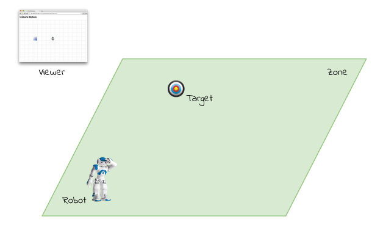

The objective of this demonstration is to show you how using Cohorte in your project increase the time-to-market intervals by focusing on business logic to implement, not distributed systems problems.

We demonstrate this quality in a simple simulated robotic project.

## Introduction

The following slides introduces the demo. We give more details in next sections.

<iframe src="https://docs.google.com/presentation/d/1F25fyJcq4KMXPB3LmJkEdxqtgnRXJSscUkCW9ZhkE4M/embed?start=false&loop=false&delayms=3000" frameborder="0" width="660" height="569" allowfullscreen="true" mozallowfullscreen="true" webkitallowfullscreen="true"></iframe>

Have a look to [this slides]({{site.baseurl}}/docs/1.x/slides/overview) to understand the COHORE Project objectives.

## Application

The purpose of this demo is to develop a simple robotics application where one or more robots move to a predefined target set by a controller. 

<a id="download_robots_snapshot" href="#" class="btn btn-success">Download Robots Nodes</a>

Note

This chapter is not yet completely written.

<< VIDEO >>

