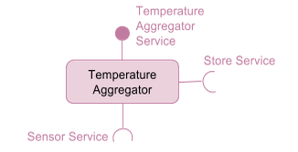

## Overview

A COHORTE application is composed of a set of components requiring and providing services. These components can be located in one node or dispatched between a set of nodes.

In a classical component-based frameworks, components are instantiated statically at a predefined locations. They are also configured to communicate together before starting the application. This leads to a situation in which a lot of configuration files should be managed (or even to recompile the components if the communication aspects are hard coded).

In contrast, COHORTE Components are instantiated, configured and placed in the right node automatically. There is no need to implement the distribution related aspects like serialization or client/server interaction. Components are seen as black-boxes wired by *declared* (remote) services. 

To understand how COHORTE components could be implemented in different languages and could be distributed in different nodes, the following picture provides some insights about the underlying architecture of COHORTE and its main technologies.

## Cohorte Isolates

What is ? Service Oriented Runtime

OSGi specification 

Java and Python Implementations

## Service Oriented Component Models (SOCM)

To implement COHORTE *managed* components, COHORTE supports two main, already existing component-based frameworks : 

 * Apache Felix iPOJO (Java)
 * Pelix/iPOPO (Python)

If you are already familiar with one of the two frameworks, all whats you have to do in order to get your components managed by COHORTE is to not instantiate them (using `@Instantiate` annotation or its XML equivalent). COHORTE will instantiate them automatically. To have benefits of Remote Services feature, your services should use primitive types instead of complex user-specific types. Next, you need to write a small description of your application components using the format explained hereafter. 

## Remote Services

What is?

## Herald

Multi-platform discovery and transport framework

Supported protocols : 

<table class="table table-striped table-condensed">
<tr><th>Transport</th><th>Discovery</th></tr>
<tr><td>HTTP</td><td>Multicast</td></tr>
<tr><td>XMPP</td><td>XMPP rooms (server)</td></tr>
</table>

## Supported SOCMs

In this section, we will provide a brief introduction to the supported Service Oriented Components Models in COHORTE.

### OSGi / Apache Felix iPOJO

Java

<table class="table table-striped table-condensed">
<tr><th>Apache Felix iPOJO (Java) </th></tr>
<tr><td>


@Component("AggregatorFactory")
@Provides
public class Aggregator implements ITemperature {
  @Requires List<ISensor> sensors;
  @Requires IStore store;

  @Validate public void start( ) {
  /* Do something to regulate 
  temperature depending on room's 
  internal temperature. */
  }
}


</td></tr>
</table>

### Pelix / iPOPO 

Python

<table class="table table-striped table-condensed">
<tr><th>Pelix iPOPO (Python) </th></tr>
<tr><td>
	

@Component("AggregatorFactory")
@Provides("java:/Itemperature")
@Requires("sensors", "java:/ISensor", aggregate=True)
@Requires("store", "java:/IStore")
class Aggregator(object):
  def __init__(self):
    self.sensors = []
    self.store = None

  @Validate 
  def start(self): 
    """
    Do something useful to regulate 
    temperature depending on room's
    internal temperature.
    """
    pass


</td></tr>
</table>

Interoperability between Java and Python implementation?

* We should add `java:/` prefix to required services in Python.

### C# support

Partial support using IronPython.

### Other legacy code

Wrapping in iPOPO (Python) or iPOJO (Java) components
