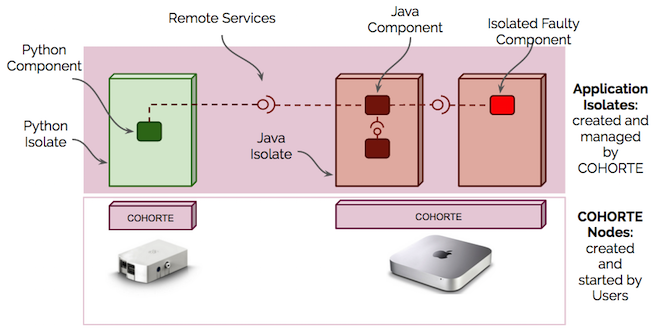

A COHORTE system is a set of (distributed) Software Components connected together using services to ensure some functionality. 

In the following sub-section, we detail the main concepts behind COHORET system.

## Dynamic Components

COHORTE Components represents a software component providing a service and eventually requiring other services to do ensure some tasks. Components can be implemented using Python or Java programming languages. We support and provide component-based framework for each language. Cohorte components implements only business logic, all the distribution and dependencies with other components are managed by COHORTE. Components can be deployed and removed dynamically without stopping the system. 

 

Java components are implemented using [Apache Felix iPOJO](http://felix.apache.org/documentation/subprojects/apache-felix-ipojo.html) component-based model.
Whereas Python components are implemented using [isandlaTech iPOPO](http://ipopo.coderxpress.net/) component-based model. This two component-based service-oriented models uses [OSGi container](http://www.osgi.org) as runtime support. C#, C and other programming languages components could be wrapper in either Java or Python supported dynamic components.

## Isolates

In COHORTE, OSGI containers could be created dynamically to host some set of related components. To communicate two remote components, COHORTE provides an implementation of *Remote Services* specification (part of OSGi specification) for Java and Python components. There is no need to provide specific configurations / proxies to get the *Remote Services* work, COHORTE provides *zero-config* approach for connecting remote services (Discovery and Transportation are automatic).

 

COHORTE provides a mechanism to isolate faulty components in a seperate OSGi containers. This is way we refer and call OSGi containers **Isolates**. 

## Nodes

COHORTE Isolates are located and managed on **COHORTE Nodes**. Nodes can be created by users using a provided scripts. Each Node can manage (create / monitor / delete) several isolates. COHORTE internal components responsible for managing local isolates and their relation with other remote isolates are located on special purpose Isolate (created at Node's startup and can not host applicative components).

 

## Composers

The Composer is a special COHORTE Runtime Component responsible of instantiating the different components of an application respecting a composition specification. In COHORTE there are different Composer levels:

 * *Top Composer*: It loads the composition declarative description and computes the sets of components according to the node they must be instantiated on.
 * *Node Composer*: It calculates the different isolates that must be exist for the local set of components.
 * *Isolate Composer*: It uses framework-specific agents to request the instantiation of the components assigned to its isolate, and looks after their evolution.

