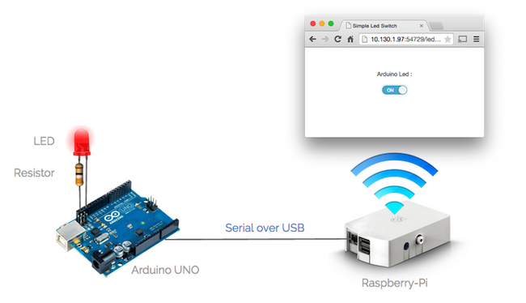
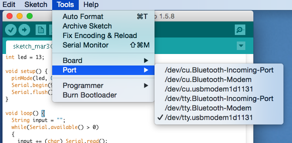
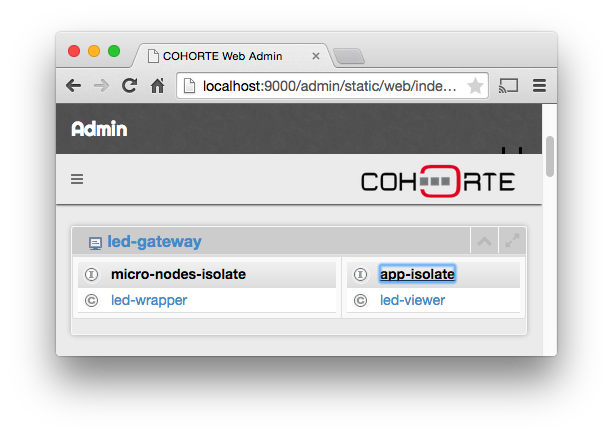
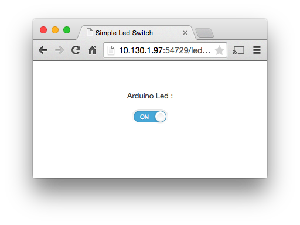

The objective of this demonstration is to show you how control an Arduino UNO using COHORTE. In particular, we will export the functionality provided by the Arduino as a Service and then use this service as a representative component of the Arduino. This avoid as to implement low level routines to control the Arduino and allow a seamless integration with other application components (using remote services).

You can download the provided COHORTE node using the following link :

<a id="download_arduino_led_snapshot" href="led-raspberry-only.zip" class="btn btn-success">Download Arduino LED Demo</a>

## Application

## Architecture

## Code

### Arduino code

Open Arduino Studio and past the following code.


int led = 13;

void setup() {
  pinMode(led, OUTPUT);
  Serial.begin(9600);
  Serial.flush();
}

void loop() {
  String input = "";
  while(Serial.available() > 0)
  {
    input += (char) Serial.read();
    delay(5);
  }
  if (input == "on")
  {
    digitalWrite(led, HIGH);
  }
  else if (input == "off")
  {
    digitalWrite(led, LOW);
  }
}


Connect the Arduino UNO with your computer, and choose the right port in the menu :

Compile and send the code to the Arduino UNO :

### Raspberry code

The downloaded demo bundle contains the following files :

#### repo/led_uno_wrapper/led_uno_wrapper.py


from pelix.ipopo.decorators import ComponentFactory, Provides, Validate, Invalidate, Property
from pelix.ipopo import constants

import serial

@ComponentFactory("led_uno_wrapper_factory")
@Property("_name", "led.name", constants.IPOPO_INSTANCE_NAME)
@Property("_serial_port", "serial.port", '/dev/tty.usbmodem1d1131')
@Provides("java:/led.services.LedService")
class LedUnoWrapper(object):

    def __init__(self):
        self._name = "led"
        self._state = "off"
        self._serial_port = None
        self._serial = None
        
    @Validate    
    def start(self, context):
        self._serial = serial.Serial(self._serial_port, 9600, timeout=5)
        #self.on()

    @Invalidate    
    def stop(self, context):
        self._serial.close()
        self._serial = None
        #self.off()

    def get_name(self):
        return self._name

    def get_state(self):
        return self._state

    def on(self):             
        if self._serial.isOpen():
            self._serial.write("on")
            self._state = "on"

    def off(self):        
        if self._serial.isOpen():
            self._serial.write("off")
            self._state = "off"

    # Java API compliance
    getName = get_name
    getState = get_state


The concrete port used by your Arduino is provided as component proprty (see composition file).

#### repo/web_viewer/viewer.py


from pelix.ipopo.decorators import ComponentFactory, Provides, Requires, Property
import pelix.remote
import os
import json

@ComponentFactory("led_viewer_factory")
@Provides('pelix.http.servlet')
@Requires("_leds", "java:/led.services.LedService", optional=True, aggregate=True)
@Property('_path', 'pelix.http.path', "/leds")
@Property('_reject', pelix.remote.PROP_EXPORT_REJECT, ['pelix.http.servlet'])
class Viewer(object):

    def __init__(self):
        self._path = None     
        self._leds = []
        self._leds_map = {}      

    def get_led(self, led):
        result = {}        
        if led in self._leds_map:
            result["name"] = led
            state = self._leds_map[led]["svc"].get_state()
            result["state"] = state
            return result
        else:    
            return {"name": "unknown", "state": "unknown"}

    def get_leds(self):
        result = {"leds": []}
        for led in self._leds_map:            
            state = self._leds_map[led]["svc"].get_state()            
            result["leds"].append({"name": led, "state": state})         
        return result

    def send_action(self, led, action):
        result = {}
        _led = self._leds_map[led]
        if _led:
            result["name"] = led
            if action == "on":
                self._leds_map[led]["svc"].on()
                result["state"] = "on"
            elif action == "off":
                self._leds_map[led]["svc"].off()
                result["state"] = "off"
        return result

    # we have omitted the remaining code handling HTTP requests for clarity    


 

#### conf/composition.js

Update the "serial.port" propery and put the concret serial over usb port used between the raspberry and the arduino UNO.


{
    "name": "raspberry-app",
    "root": {
        "name": "raspberry-app-composition",
        "components": [
            {
                "name" : "led-uno-wrapper",
                "factory" : "led_uno_wrapper_factory",
                "properties" : {
                    "led.name" : "my-led",
                    "serial.port" : "/dev/ttyACM0"
                },
                "isolate" : "devices" 
            },
            {
                "name" : "led-viewer",
                "factory" : "led_viewer_factory",
                "isolate" : "ui"
            }
        ]
    }
}


## Running

* Connect the Arduino UNO with the Raspberry.

* Ensure to have COHORTE [installed]({{site.baseurl}}/docs/1.x/setup) in your Raspberry system (choose Python-distribution from the download page).

* Go to `led-gateway` folder of the downloaded zip file and launch COHORTE node: 

<pre>
$ ./<b>run</b>
</pre>

* Open a web browser with the following address: `http://localhost:9000/admin`

* Click on the `app-isolate` isolate which contains the `led-viewer` component, and then click on the *HTTP SERVICE* link on the showed modal window. This will open the http server page of this isolate on which a list of the published servlets is showed. Ckick on `/leds` link to access the `led-viewer` page.
Viewer web page :

You can control now the LED of the Arduino using the ON/OFF button of the web interface. 

## Final remarks 

* You can give a static url path to your viewer's container so that you can access it using your web mobile browser without retyping the url each time.
* We can deploy the viewer anywhere we want. If your deployment infrastructure is limited to a local network area, you can start COHORTE in HTTP mode. 
* You can add an intermediate component that controls a set of LEDs (or Arduinos). This depends on your needs for one specific scenario. Thanks to COHORTE your Arduino is seen as a service which can be consumed locally or remotely with no supplemental efforts. 

<!--

-->