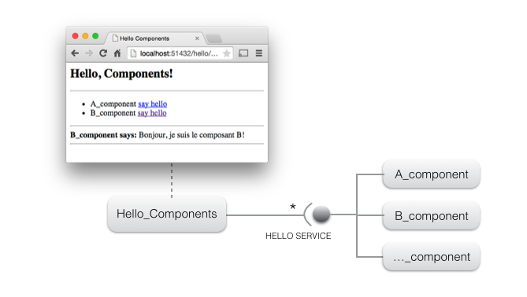
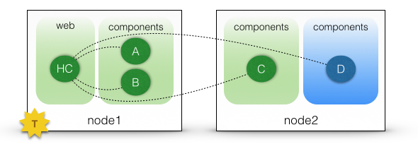
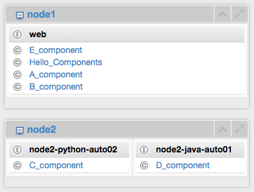
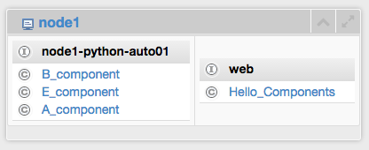
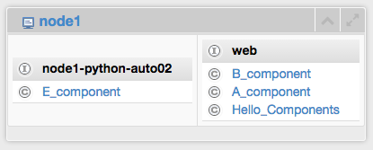

 As a COHORTE user, you need to have Java ( >= 1.6 ) and Python ( >= 3 ) installed on your system. Next, you need to [download]({{site.baseurl}}/downloads) and [install]({{ site.baseurl }}/docs/1.x/setup) COHORTE on your system.
 
 The objective of this getting started tutorial is to get you familiar with COHORTE concepts as quickly as possible. There is no need to start coding at this step. You find other advanced tutorial in the tutorials section of the [documentation page]({{ site.baseurl }}/docs/1.x/).

The following picture depicts the architecture of the to be developed application. It consists of a web interface provided by a component called `Hello_Components` which uses the **HELLO SERVICE** to interact with all other components implementing this service (`A_component`, `B_component`, etc). 

Hello components (implementing the **HELLO SERVICE**) can be implemented using different programming languages (*Java* and/or *Python*) and can be placed in different remote nodes. Developers have not to worry about this details. COHORTE manages to have all the application components interacts as they where in one place (Using [Remote Services]({{ site.baseurl }}/docs/1.x/components)). 

The remainder of this tutorial is organized in four steps :

 * **[STEP 1](#step1)** : creating a simple application on one node, but two seperate isolates. 
 * **[STEP 2](#step2)** : using two distributed nodes to host the same application (without changing the components implementation code).
 * **[STEP 3](#step3)** : using a mixture of Java and Python components.
 * **[STEP 4](#step4)** : crash-test

## Creating a simple application (one node)

 In this first step of the tutorial, we want to instantiate only the components `Hello_Components` (**HC**), `A_component` (**A**) and `B_component` (**B**). In addition, we want to seperate between **HC** component and other components providing HELLO SERVICE (which can contain third-party code). COHORTE supports this separation by using **Isolates**. Isolates are a seperate process with all the needed runtime infrastructure allowing the execution of the managed components.

 The following picture depicts the desired resilient architecture. If one of the components providing the HELLO SERVICE fails, there will be no impact on HC component! 

### Preparing the execution node

 * Open a new terminal and type the following command on your working directory:

<pre>
$ <b>cohorte-create-node</b> --name node1 --app-name getting-started
</pre>

This command will create a new directory named `node1` containing an executable `run` (which launches the created COHORTE node) and two folders `conf` (containing configuration files) and `repo` (where user bundles should be placed).

 * Download the first bundle of this tutorial (no need to implement the components in this getting started tutorial, they are already prepared for you)
 * Put the extracted `hello` directory into `node1/repo`. 

<a id="download_hello_demo_python_snapshot" href="#" class="btn btn-success">Download Hello Python Bundle</a>

Information

The `hello` package contains four components (implemented in Python):  
<ul>
  <li> <b>A_component</b>, <b>B_component</b>, <b>C_component</b> and <b>E_component</b>: these components implements the HELLO SERVICE. <b>E_component</b> contains faulty code to test the self-healing feature of COHORTE (used in the fourth step).</li>
  <li> <b>Hello_Components</b>: this component provides a web interface on which the list of discovered components implementing the HELLO SERVICE are listed (users can call the <code>say_hello</code> method of each components by clicking on "say hello" link).</li>
</ul>

### Preparing the deployment plan (composition)

In order to have this deployment plan corresponding to the resilient architecture detailed before, you should edit the `node1/conf/composition.js` file to specify the set of components that will be instantiated on each isolate.


{
	"name" : "getting-started",
	"root" : {
		"name" : "getting-started-composition",
		"components" : [ 
			{
				"name" : "Hello_Components",
				"factory" : "hello_components_factory",
				"isolate" : "web"
			}, {
				"name" : "A_component",
				"factory" : "component_a_factory",
				"isolate" : "components"
			}, {
				"name" : "B_component",
				"factory" : "component_b_factory",
				"isolate" : "components"
			}
		]
	}
}


**It's done!** all what's you need to do now is starting `node1` to launch your application.

### Starting the node

Change your working directory to `node1` and type : 
 <pre>
$ ./<b>run</b> --app-id getting-started-app-id --top-composer true
</pre>

The `--app-id` argument is required for each COHORTE node. If you have more than one node (as we will see further), all the nodes should be started with the same application's identifier. The `--top-composer` option is set to true which means that this node is executed as a Top Composer. The Top Composer is responsable for calculating the distribution of the application components.

### Testing our Hello Components application

To test your application, you need to know on which http port the `web` isolate is listening (as the HC component publish its web page using the same HTTP server as its isolate container). Type the `http` command to have this information.

<pre>
$ <b>http</b>

+------------+--------------------------------------+-----------+--------------------------------------+-------+
|    Name    |                 UID                  | Node Name |               Node UID               | HTTP  |
+============+======================================+===========+======================================+=======+
| components | 9fa3c812-64b0-499e-8b65-6ac5fe8bcf02 | node1     | 71c96fe6-5ce2-43c9-bafc-6f0905d8cf74 | 63625 |
+------------+--------------------------------------+-----------+--------------------------------------+-------+
| web        | ac0dd576-a7fb-4c34-b7ab-b68a810c38bc | node1     | 71c96fe6-5ce2-43c9-bafc-6f0905d8cf74 | 63609 |
+------------+--------------------------------------+-----------+--------------------------------------+-------+

</pre>

In this case, its `63609`. Launch a web browser with this address to start the web interface: `http://localhost:63609/hello`.

To stop COHORTE, type `quit` command on the terminal.

## <a name="step2">Distributing the application (two nodes)

In this second step, we will distribute our components among two nodes (which can be physically distributed on a local network area - or via Internet using an XMPP server).

In this step, we will add a new instance of C_component that should be deployed on a second node (C_component implementation code is already provided on the downloaded Hello Python Bundle). 

 Here is the new depoyment configuration (composition) for this case. 

### Preparing the second execution node

Start first by creating a second COHORTE node named `node2` at the parent level.

<pre>
$ <b>cohorte-create-node</b> --name node2
</pre>

Then, copy the same *hello bundle* located on `node1/repo` into `node2/repo` directory.

Note

In future versions, you will not copy your bundles manually into the <i>repo</i> directory of the participating nodes. This will be done automatically using an internal <i>provisioning</i> module. 

We will then update our *composition* file to fit this new situation.

### Updating the composition file

Ensure to have stopped the previous execution and update the `composition.js` file located on `node1/conf` as follow : 


{
	"name" : "getting-started",
	"root" : {
		"name" : "getting-started-composition",
		"components" : [ 
			{
				"name" : "Hello_Components",
				"factory" : "hello_components_factory",
				"isolate" : "web"
			}, {
				"name" : "A_component",
				"factory" : "component_a_factory",
				"isolate" : "components1"
			}, {
				"name" : "B_component",
				"factory" : "component_b_factory",
				"isolate" : "components1"
			}, {
				"name" : "C_component",
				"factory" : "component_c_factory",
				"isolate" : "components2",
				"node" : "node2"
			}
		]
	}
}


Note

The C_component is specified to be in another isolate (named "components2") rather than "components1" isolate containing the first components. In the actual version of COHORTE you can not have two different isolates with the same name in two different nodes!

**It's done!** all what's you need to do now is starting `node1` as Top composer and `node2` as simple node (also called Node Composer). 

### Starting the nodes

<pre>
node1$ ./<b>run</b> --app-id getting-started-app-id --top-composer true
</pre>

You can test this first part of the application as your `hello_components` component is instantiated in this node (*web isolates*). Follow the same steps as in the first part of this tutorial to find the http port and to launch the web interface. You notice that there is only two components A and B. This is because C component is specified to be instantiated on `node2` which is not yet started.

In a separate terminal, start `node2` as follow :

<pre>
node2$ ./<b>run</b> --app-id getting-started-app-id
</pre>

Refresh the web interface. You will notice that the C component is detected and used by the HC component even if it was deployed in a separate remote node.

## <a name="step3">Using heterogeneous components (Java and Python)

All the components used until now are implemented in Python. We will extend our application by introducing a new component that implements the HELLO SERVICE in Java (D_component). 

 * Stop the running nodes of the previous step (use the command `quit`).
 * Donwload the bundle (jar file) containing the implementation code of the D component.

<a id="download_hello_demo_java_snapshot" href="#" class="btn btn-success">Download Hello Java Bundle</a>

 

 * Put the extracted `jar` file into `node2/repo` directory. 
 * Update the `composition.js` file located on `node1/conf` to add this new D component. It should be instantiated on `node2`.


{
	"name" : "getting-started",
	"root" : {
		"name" : "getting-started-composition",
		"components" : [ 
			{
				"name" : "Hello_Components",
				"factory" : "hello_components_factory",
				"isolate" : "web"
			}, {
				"name" : "A_component",
				"factory" : "component_a_factory",
				"isolate" : "components1"
			}, {
				"name" : "B_component",
				"factory" : "component_b_factory",
				"isolate" : "components1"
			}, {
				"name" : "C_component",
				"factory" : "component_c_factory",
				"isolate" : "components2",
				"node" : "node2"
			}, {
				"name" : "D_component",
				"factory" : "component_d_factory",
				"isolate" : "components3",
				"node" : "node2"
			}
		]
	}
}


### Starting the nodes

Start the first node with one more argument `--web-admin` in order to visualize the global application's architecture using the *Web Admin* utility.

<pre>
node1$ ./<b>run</b> --app-id getting-started-app-id --top-composer true --web-admin 9000
</pre>

Start the second node as done before :

<pre>
node2$ ./<b>run</b> --app-id getting-started-app-id
</pre>

### Monitoring the application

Type `http` command in `node1`'s terminal and get the *http* port of the *web* isolate. Then test your application in web browser as done before. You will get something like that :

In order to see the runtime architecture of your application, open a new tab in your browser and hit the following address : `http://localhost:9000/admin`

The *Web Admin* utility is opened. You notice the following architecture : 

This correspond to this deployment plan :

As you notice, C and D components should be deployed on two sperate isolates (*components2* and *components3*) as they are implemented in two different languages.

## <a name="step4"> crash-test!

We introduce a new component **E_component** which has a faulty `say_hello` method implementation. 

**Composition file** :

We should note force the components to be in predefined isolates if we are not sure about their code quality. Indeed, in the composition specification, only the *Hello_Components* component is affected to a predefined isolate *web*. This also allows providing isolate configurations (like the HTTP Service port used by its components).


{
	"name" : "getting-started",
	"root" : {
		"name" : "getting-started-composition",
		"components" : [ 
			{
				"name" : "Hello_Components",
				"factory" : "hello_components_factory",
				"node" : "node1"
			}, {
				"name" : "A_component",
				"factory" : "component_a_factory",
				"node" : "node1"
			}, {
				"name" : "B_component",
				"factory" : "component_b_factory",
				"node" : "node1"
			}, {
				"name" : "E_component",
				"factory" : "component_e_factory",
				"node" : "node1"
			}, {
				"name" : "C_component",
				"factory" : "component_c_factory",				
				"node" : "node2"
			}, {
				"name" : "D_component",
				"factory" : "component_d_factory",
				"node" : "node2"
			}
		]
	}
}


**Initial runtime composition** :

**After the first crash** :

Node2 is not affected, it is not showed hereafter.

**After the second crash** :

The component **E_component** source of problems is isolated from other stable components.

