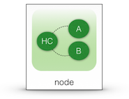
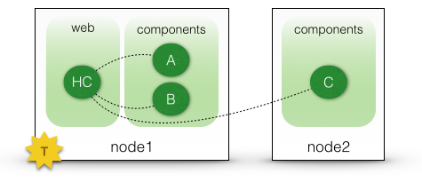

[Home](../../../../) > [Documentation](../../) > [Tutorials](../)

## Getting started tutorial

### Overview

 * As a COHORTE user, you need to have Java ( >1.6 ) and Python ( 3 ) installed on your system.
 * Next, you need to download and install COHORTE on your system ([detailed information are given in this page]({{ site.baseurl }}/docs/1.x/setup)).
 * The objective of this getting started tutorial is to get you familiar with the COHORTE concept as quickly as possible. There is no need to start coding at this step. You found other advanced tutorial in the [tutorials section of the documentation page]({{ site.baseurl }}/docs/1.x/tutorials).
 * This getting started tutorial is divised on three steps:
   * STEP 1: creating a simple application on one node, but two seperate isolates. 
   * STEP 2: the same application of the first step will be deployed on two distributed nodes without changing the components implementation code.
   * STEP 3: crash-test

### Step 1

 * Open a new terminal and type the following command on your working directory:

 <pre>
$ <b>cohorte-create-node</b> my-pc
</pre>

This will create a new directory named `my-pc` containing an executable `run` and two folders `conf` and `repo`.

 * The `repo` directory will contain the components code. For this first getting started tutorial, they are already implemented for you. You have to donwload them and extract the downloaded file in the `repo` directory.

 

 * Next

`step1/autorun_conf.js`

{
	"name" : "hello-demo-app-step2",
	"root" : {
		"name" : "hello-demo",
		"components" : [ {
			"name" : "hello_components",
			"factory" : "hello_components_factory",
			"language" : "python",
			"isolate" : "web"
		}, {
			"name" : "component_A",
			"factory" : "component_A_factory",
			"language" : "python",
			"isolate" : "components"
		}, {
			"name" : "component_B",
			"factory" : "component_B_factory",
			"language" : "python",
			"isolate" : "components"
		}, {
			"name" : "component_C",
			"factory" : "component_C_factory",
			"language" : "python",
			"isolate" : "components"
		}  ]
	}
}


### Step 2

`step2/autorun_conf.js`

{
	"name" : "hello-demo-app-step2",
	"root" : {
		"name" : "hello-demo",
		"components" : [ {
			"name" : "hello_components",
			"factory" : "hello_components_factory",
			"language" : "python",
			"isolate" : "web",			
			"node" : "node1"
		}, {
			"name" : "component_A",
			"factory" : "component_A_factory",
			"language" : "python",
			"isolate" : "components",
			"node" : "node1"
		}, {
			"name" : "component_B",
			"factory" : "component_B_factory",
			"language" : "python",
			"isolate" : "components",
			"node" : "node1"
		}, {
			"name" : "component_C",
			"factory" : "component_C_factory",
			"language" : "python",
			"isolate" : "components",
			"node" : "node2"
		}  ]
	}
}


If the two COHORTE nodes are located on the same physical machine, you should override the HTTP service port.

`node2/conf/boot-forker.js`

{
	"import-files" : [ "boot-forker.js" ],

	"composition" : [
	{
		"name" : "pelix-http-service",
		"properties" : {
			"pelix.http.port" : 9000
		}
	}, {
		"name" : "pelix-remote-shell",
		"properties" : {
			"pelix.shell.port" : 9001
		}
	} ]
}


[Home](../../../../) > [Documentation](../../) > [Tutorials](../)

