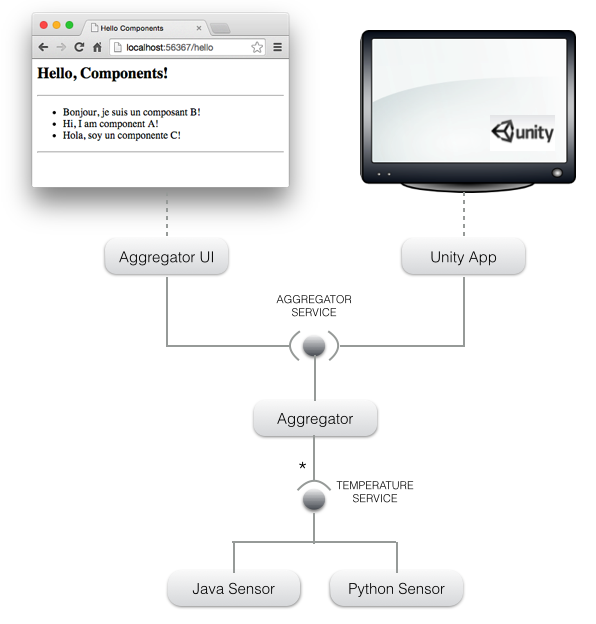
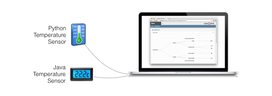
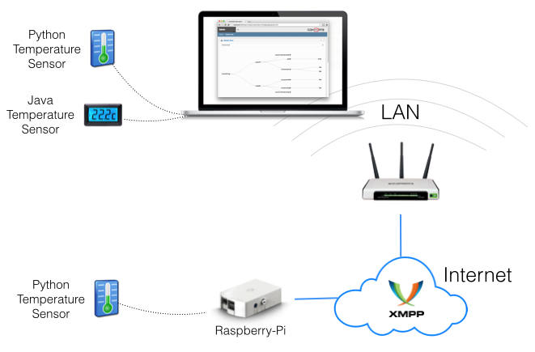
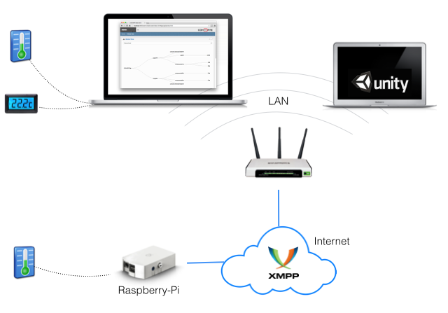

In this tutorial we will have a complete working temperature aggregation application with different type of components and deployment devices.

Let's first talk about the application's architecture.

## Application

The *temper* application has a *service-oriented architecture SOA* composed of components and services depicted in the following picture:

There are two services:

* **TEMPERATURE SERVICE**: this is the interface for all temperature sensor devices. Users can implement it in Python or Java while respecting the provided interface. It has three methods:
  * `get_name`: retrieves the name of the sensor.
  * `get_unit`: retrieves the values unit name.
  * `get_value`: retrieves the current value of the sensor.

* **AGGREGATOR SERVICE**: collects the temperature of the connected sensors (using the TEMPERATURE SERVIC) and stock them locally. The stocked information is used by third-party visualisation interfaces (*web interface* or *Unity 3D interface*) using the following methods:
  * `get_history`: retrieves the whole known history as a dictionary.
  * `get_sensor_history`: retrieves the known history for the given sensor.
  * `get_sensors`: retrieves the list of sensors visible in the history.
  * `get_active_sensors`: retrieves the list of active sensors.

## Deployment and runtime configuration

Now, its time to manage the deployment of these components. In this use case, we can have different type of execution machines:

* **gateway-node** : any personal computer or integrated homebox that can hosts and runs the *aggregator* component as well as the *web interface* component.
* **java-sensor-node** : any personal computer that can hosts and runs  Java sensor components.
* **python-sensor-node** : any personal computer that can hosts and runs Python sensor components.
* **raspberry-node** : any Raspberry-Pi device that can hosts and runs Python sensor component.
* **datashower-node** : any personal computer that can hosts and runs the *Unity 3D engine*. 

COHORTE provides a [*composition language*]({{ site.baseurl }}/docs/1.x/compositions) which helps administrators fixing some rules concerning the deployment and instantiation of application components. 

The following picture depicts the graphical notation of the resulting specification for this use case:

Legend:

* **JS**: Java temperature Sensor
* **PC**: Python temperature Sensor
* **A**: temperature Aggregator 
* **UI**: web User Interface
* **U**: Unity 3D interface 

The following JSON file (`gateway-node/conf/composition.js`) represents the JSON equivalent for this deployment and composition specification:


{
	"name" : "temper-demo",
	"root" : {
		"name" : "temper-demo-composition",
		"components" : [ 
		{
			/**
			 * Python sensor
			 */
			"name" : "PythonSensor",
			"factory" : "python-sensor-factory",
			"isolate" : "temper.python",
			"node" : "python-sensor-node",
			"properties" : {
				"temper.value.min" : -5,
				"temper.value.max" : 45
			}
		}, {
			/**
			 * Raspberry Pi sensor
			 */
			"name" : "PythonSensor-raspi",
			"factory" : "python-sensor-factory",
			"isolate" : "temper.raspi",
			"node" : "raspberry-node"
		}, {
			/**
			 * Java sensor
			 */
			"name" : "JavaSensor",
			"factory" : "java-sensor-factory",
			"isolate" : "temper.java",
			"node" : "java-sensor-node"
		}, {
			/**
			 * Aggregator component
			 */
			"name" : "Aggregator",
			"factory" : "aggregator-factory",
			"language" : "python",
			"isolate" : "aggregation",
			"node" : "gateway-node",
			"properties" : {
				"poll.delta" : 1
			}
		}, {
			/**
			 * Aggregator web UI
			 */
			"name" : "UserInterface",
			"factory" : "aggregator-ui-factory",
			"language" : "python",
			"isolate" : "web.interface",
			"node" : "gateway-node",
			"properties" : {
				"servlet.path" : "/temper"
			},
			"wires" : {
				"_aggregator" : "aggregator"
			}
		}
		]
	}
}


Note

The Unity 3D component is not specified in this composition specification as it will be deployed as a static isolate (components are instantiated at startup by the isolate, not by the Top Composer).

## COHORTE Nodes

We have created and prepared the different COHORTE nodes for each of the targeted devices. Each node contains the necessary bundles deployed on the `repo` directory and configuration files on the `conf` directory.

<a id="download_temper_snapshot" href="#" class="btn btn-success">Download Temper Nodes</a>

Extract the downloaded zip file somewhere in your file system. You can try the different nodes in the same machine or distribute them in different machines.

Ensure to have COHORTE installed on your system. If not the case, refer to the [downloads]({{ site.baseurl }}/downloads) page to get the latest available version and to the [setup documentation]({{ site.baseurl }}/docs/1.x/setup) for installation details. 

## Demonstrations

In the next steps, we will use the nodes to execute our application. For clarity, we will proceed the execution of the temper application following these steps : 

* **[STEP 1](#step1)** : in the same machine, we start three COHORTE nodes (*gateway*, *java-sensor-node*, and *python-sensor-node*). We monitor the application's architecture to see the automatically created isolates and their components.   
* **[STEP 2](#step2)** : we start a Raspberry-Pi device containing the *raspberry-pi* COHORTE node. We highlight the dynamic capabilities of COHORTE and its remote-services feature.
* **[STEP 3](#step3)** : at the final step, we start another machine containing the *datashower* COHORET node. We highlight the capability of COHORTE to deal with different components implemented in different languages (here C#).

### Components Isolation and multi-language implementations

At this first step, we highlight the multi-language components implementation supported by COHORTE. In our described application in section 1, the Hello Service is implemented in Python and in Java. In this demonstration we will show you how COHORTE manage to have the same runtime infrastructure for either Java or Python implementations. We see also how COHORTE creates Isolates as described in the *composition specification* (and as responds to runtime crashes). 

At this first step, we will launch three COHORTE nodes :

* **gateway-node** as Top Composer
* **python-sensor-node** 
* **java-sensor-node**

### Distributed Application

### .Net interaction via Unity 3D framework

The objective of this first step is to show you ... 

#### Temperature Aggregator

To have a distributed configuration of COHORTE applications, we need to select one node as a **Top Composer**. It will parse the *composition configuration* and push orders to the participating nodes to instantiate the different components. 

You can create a new Node and start it as a Top Composer, or start any of the provided nodes as a Top Composer (using -t option). 

In the following, we choose the `gateway` node as Top Composer.

<pre>
gateway$ <b>./run</b> -t
</pre>

You should start the composition (deployment of components) manually by typing the `load` command.


> load


We can already test the application by opening a web browser and hiting this address: `http://localhost:port/temper`. You should however put the right *http port* of the `web.interface` isolate executing the web interface (see the *temper-demo* composition picture above). Type `http` command in the terminal to have the list of isolates and their *http ports*.

--IMAGE

You notice that there is no input in the history table as no temperature sensor is active.

Note

Ensure to have COHORTE properly <a href="{{ site.baseurl }}/docs/1.x/setup">installed on your devices</a>. You should have $COHORT_HOME environment variable set with the full path to the COHORTE installation folder and $COHORTE_HOME/bin folder is added to your $PATH. 

#### Temperature Sensors

It's time now to start the temperature sensors. The provided components provides dummy values for simplicity. You can implement your temperature sensor component as detailed at the end of this tutorial.

* Start the `python-sensor-pc` node with a different *http* and *shell* ports configuration:

<pre>
python-sensor-pc$ <b>./run</b> 38001 38002 
</pre>

You will notice new entries in the active devices list of the aggregator web interface corresponding to this newly started sensor node (containing a temperature sensor component).

You can also start the `java-sensor-pc` node to test it. Ensure to put another http and shell ports configuration.

To test the `raspberry-pi` node, you should have a real *raspberry-pi* device connected to the local network. 

Notice that you can run copies of java or python sensor nodes in multiple devices without changing anything. 

