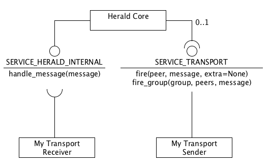

# Herald Specification v1

## Introduction

Cohorte platform is based on Herald Framework for the discovery and transport between the different isolates. However, Herald is a completely seperate project which could be used for your own cases.

Herald abstarct the transport protocols used between peers, and allows each peer to send message to one or more peers by just knowing its UID (or the group name).

Herald is based on [iPOPO]() python component framework and hence requires [Pelix]() runtime to run. It has also a Java implementation that works on any [OSGi]() platform with [iPOJO]() component model.

This documentation is about `Herald Specification v1`.

This specification is split into this chapters:

* Chapter 1 - Introduction
* Chapter 2 - Terminology
* Chapter 3 - Message Format
* Chapter 4 - Sending Messages
* Chapter 5 - Receiving Messages
* Chapter 6 - Transport
* Chapter 7 - Discovery
* Chapter 8 - Using Herald
* Chapter 9 - Implementations
* Chapter 10 - Extending Herald

## Terminology

<table class="table table-striped table-bordered table-hover table-condensed">
<thead><tr><th>Term</th><th>Definition</th></tr></thead>
<tbody><tr><td><b>OSGi</b></td><td>
Specification for modular and dynamic applications based on service-oriented approach.
</td></tr>
<tr><td><b>Peer</b></td><td>
Represents one OSGi node (runtime). It has a unique UID (Universal IDentifier) and a symbolic name.
</td></tr>
<tr><td><b>Group</b></td><td>
A set of Peers regrouped logically in one group. A peer can be associated to several groups.
</td></tr>
<tr><td><b>Access</b></td><td>
Supported protocols for one peer. Two peer should have the same access type to communicate.
</td></tr>
<tr><td><b>Message</b></td><td>
Object containing the data to be transported and metadata useful for the framework or user needs.
</td></tr>
<tr><td><b>Directory</b></td><td>
Internal storage on each peer that has information about discovered peers.
</td></tr>
<tr><td><b>Discovery</b></td><td>
Operation on which a peer discover other peers of the same application (having same AppID). Their information is stocked on the local Directory.
</td></tr>
<tr><td><b>Transport</b></td><td>
...
</td></tr>
<tr><td><b>AppID</b></td><td>
An application ID is associated to each peer: only peers with the same application ID can discover each other.
</td></tr>

</tbody>
</table>

## Message Format

Herald Message is a JSON object with the following structure :


{
  "herald-version": 1,       # herald specification version
  
  "headers": {
     "uid": "",              # the unique universal identifier of the message.
     "timestamp" : 0,        # the time the message was created.      
     "sender-uid": "",       # the uuid of the peer which emits the message.
     "send-mode": "",        # the sending mode (fire, post, send)
     
     "replies-to": "",       # uid of message that triggeed this one (send mode)
     "replied": "",          # indicates if the message was already replied
     "access": ""            # access ID of the transport which received this message
  },  
  
  "target" : "",             # peer:<uuid> or group:<name>
  "subject" : "",            # the subject of the message. e.g., toto/titi
  "content" : {},            # the message content
   
  "extra" : {}               # user provided meta-infos and future features
}


Here is a description and semantic of each of this entries :

<table class="table table-striped table-bordered table-hover table-condensed">
<thead><tr><th>Entry</th><th>Description</th></tr></thead>
<tbody><tr><td><b>herald-version</b></td><td>
Herald Specification version (integer).
</td></tr>
<tr><td><b>headers</b></td><td>
Each message has a map of standard headers about the message. This headers are set by the framework and not by users. In case of a newly sent message, we have: 
    <ul>
        <li><b>uid:</b> the message unique identifier.</li>
        <li><b>timestamp:</b> the data on which the message was created.</li>
        <li><b>sender-uid:</b> the UID of the sender (peer).</li>
        <li><b>send-mode:</b> which sending mode was used to send the message? the supported sending modes are: fire, post, and send (see <a href="#">Chapter 4 - Sending Messages</a>)</li>        
    </ul>
    In addition, for a response message, we have also this headers :
    <ul>
        <li><b>replies-to:</b> the UID of the message that triggered this one and which its sender is waiting for a response.</li>
        <li><b>replied:</b> a boolean indicating if the message was replied by the receiver or not.</li>
        <li><b>access:</b> Access ID of the transport which received this message</li>
    </ul>
    Herald Transports could also add other specific headers that should be different from the standard headers.
</td></tr>
<!--
<tr><td><b>transport-data</b></td><td>
...
</td></tr>
-->
<tr><td><b>target</b></td><td>
The target of the message. It could be one peer, or a group of peers. In case of one peer target, we should provide its UID after <code>peer:</code> prefix. E.g., <code>peer:cb877370-249e-4a51-bd2b-18cc29df02de</code>. In case of the message is destinated for a group of peers, we should provide the group name after the <code>group:</code> prefix. E.g., <code>group:all</code>.
</td></tr>
<tr><td><b>subject</b></td><td>
a String identifying the purpose of the message. It is recommended to use URI (Uniform Resource Identifier) syntax. E.g., <code>"/update/info"</code>. Message receivers can filter which message to take according to their subjects.
</td></tr>
<tr><td><b>content</b></td><td>
any content.
</td></tr>
<tr><td><b>extra</b></td><td>
a map of extra informations (user-specific).
</td></tr>

</tbody>
</table>

**Python Class**

The `Message` class encapsulates Herald JSON message.
The following snipet shows the constructor's code of this class in Python programming language.

`herald/beans.py` 


class Message(object):
    """
    Represents a message to be sent
    """
    def __init__(self, subject, 
                       content=None,
                       target_id=None, 
                       target_type=None, 
                       sender_uid=None, 
                       send_mode=None, 
                       replies_to=None):
        
   

Example : 


msg1 = herald.beans.Message(subject="toto/toti", content="Hello Peer!")

msg2 = herald.beans.Message("koko/koki")
msg2.set_content("Hello Herald!")    # notice that we can also send a message without content


Message headers are set by the Message constructor or by the sending service calls. At any way, you should not modify headers manually.

For each of this headers and base data, the Message class provides properties to quickly retrieve the required (meta)data.


@property
def uid(self):
    """
    Message UID
    """

@property
def timestamp(self):
    """
    Time stamp of the message
    """

@property
def sender(self):
    """
    Sender Peer UID
    """

@property
def send_mode(self):
    """
    Send mode
    """

@property
def replies_to(self):
    """
    UID of Peer to be replyed
    """

@Property
def target(self):
    """
    The target of the message (peer:<uid> or group:<name>)
    """

@Property
def target_id(self):
    """
    The id of the target of the message (<uid> or <group_name>)
    """

@Property
def target_type(self):
    """
    The type of the target of the message (peer or group)
    """

@property
def subject(self):
    """
    The subject of the message
    """

@property
def content(self):
    """
    The content of the message
    """
 

For `MessageReceived` objects (which inherits from `Message` class), we have in addition:


@property
def access(self):
    """
    Returns the access ID of the transport which received this message
    """

@property
def replied(self):
    """
    A tag (boolean) indicating if this message was sent back to the original peer 
    """


Herald Transports can send any Heral Message without any other metadata. All needed information is encapsulated in the Message object. In addition, the Message object can exports its data to three supported formats:


def to_json(self):
    """
    Returns a JSON representation of this message
    """

def to_bson(self):
    """
    Returns a Bonary JSON object of this message
    """

def to_raw(self):
    """
    Returns a RAW object of this message. No metadata will be sent, 
    only the content of the message
    """
 

Herald Transports can take the exported data and send it using protocol specific transport.
At the other side, Herald Transports can construct a `Message` object from the received RAW, BSON, or JSON data. The `Message` class has three static methods for that:


@Staticmethod
def from_json(json_message):
    """
    Returns a new Message from the provided json_message
    """

@Staticmethod
def from_bson(bson_message):
    """
    Returns a new Message from the provided bson_message (Binary JSON)
    """

@Staticmethod    
def trom_raw(raw_message):
    """
    Returns a new Message from the provided raw_message
    """
 

## Sending Messages

There are several ways to send Herald message depending on the need of the sender. 

* `fire` : Fires (and forget) the given message to the target
* `fire_group` : Fires (and forget) the given message to the given group of peers
* `send` : Sends a message, and waits for its reply
* `post` : Posts a message. The given methods will be called back as soon as a result is given, or in case of error 
* `post_group` : Posts a message to a group of peers. The given methods will be called back as soon as 
a result is given, or in case of error

* `reply` : ...

All this methods are defined in `herald/core.py` and are exported as a service `herald.SERVICE_HERALD`. 

#### Fire 


def fire(self, target, message):
    """
    Fires (and forget) the given message to the target

    :param target: The UID of a Peer, or a Peer object
    :param message: A Message bean
    :return: The UID of the message sent
    :raise KeyError: Unknown peer UID
    :raise NoTransport: No transport found to send the message
    """        


This method will looks for the supported accesses on the target peer, and uses the corresponding local accesses of the local peer to send the message. The sending operation is delegated to the *transport* module associated with each access. This method returns immediatly. 

#### Fire_group 


def fire_group(self, group, message):
    """
    Fires (and forget) the given message to the given group of peers

    :param group: The name of a group of peers
    :param message: A Message bean
    :return: A tuple: the UID of the message sent and the list of peers
    :raise KeyError: Unknown group
    :raise NoTransport: No transport found to send the message
    """


This method will looks for all peers of the targeted group, and send a copy of the message for each one. It returns a tuble consisting of the UID of the message sent and the list of peers.

#### Send 


def send(self, target, message, timeout=None):
    """
    Sends a message, and waits for its reply

    :param target: The UID of a Peer, or a Peer object
    :param message: A Message bean
    :param timeout: Maximum time to wait for an answer
    :return: The reply message bean
    :raise KeyError: Unknown peer UID
    :raise NoTransport: No transport found to send the message
    :raise NoListener: Message received, but nobody was registered to
                       listen to it
    :raise HeraldTimeout: Timeout raised before getting an answer
    """


This method is similar to `fire` but the caller remains blocked until a response is returned back. 

#### Post 


def post(self, target, message, callback, errback,
         timeout=180, forget_on_first=True):
    """
    Posts a message. The given methods will be called back as soon as a
    result is given, or in case of error

    The given callback methods must have the following signatures:
      - callback(herald, reply_message)
      - errback(herald, exception)

    :param target: The UID of a Peer, or a Peer object
    :param message: A Message bean
    :param callback: Method to call back when a reply is received
    :param errback: Method to call back if an error occurs
    :param timeout: Time after which the message will be forgotten
    :param forget_on_first: Forget the message after the first answer
    :return: The message UID
    :raise KeyError: Unknown peer UID
    :raise NoTransport: No transport found to send the message
    """


This method is similar to `Send`but the caller does not remain blocked. This method returns immediatly and the provided callback method will be called when an answer is received.

#### Post_group


def post_group(self, group, message, callback, errback,
               timeout=180):
    """
    Posts a message to a group of peers. The given methods will be called
    back as soon as a result is given, or in case of error.

    If no timeout is given, the message UID must be forgotten manually.

    :param group: The name of a group of peers
    :param message: A Message bean
    :param callback: Method to call back when a reply is received
    :param errback: Method to call back if an error occurs
    :param timeout: Time after which the message will be forgotten
    :return: The message UID
    :raise KeyError: Unknown group
    :raise NoTransport: No transport found to send the message
    """


Similar to `Post` but the message will be sent for all peers of the targeted group.

#### Reply 


def reply(self, message, content, subject=None):
    """
    Replies to a message

    :param message: Original message
    :param content: Content of the response
    :param subject: Reply message subject (same as request if None)
    :raise NoTransport: No transport/access found to send the reply
    """


This method is called to return a reply message to the original peer.

## Receiving Messages

## Transport

## Discovery

All peers of the same application (having same AppID) are discovered by Herald. This is done by Transport providers implementing specific discovery techniques. 

What ever the discovery technology used by transport providers, they should all respect the following protocol :

When a peer L (local) detects another peer D (discovered) :

* L sends a message to D containing a description about thim (L_dump) and having `herald/discovery/step1` as subject.

* D saves L_dump on his local directory without notifying other listeners about this message arrival.

* D sends a message to L containing its description (D_dump) and having `herald/discovery/step2` as subject.

* L saves D_dump on his local directory and notifies Herald about this new discovered peer. It is now accessible and messages could be sent to it.

* L sends a message to D to finish the discovery synchronization, it has `herald/discovery/step3` as subject.

* D receives this message and notifies Herald about this new discovered peer.  

## Using Herald

Herald is used as Service in an [OSGi](http://osgi.org) platform runtime. 

### Herald Bundles

* `herald.core`
* `herald.directory`
* `herald.shell`
* herald... (transports, discovery, etc)

### Initial configuration

* `herald.FWPROP_NODE_UID`
* `herald.FWPROP_NODE_NAME`
* `herald.FWPROP_PEER_NAME`
* `herald.FWPROP_PEER_GROUPS`
* `herald.FWPROP_APPLICATION_ID`

This configurations are used by Herald Directory to create a local Peer.

### Binding to Herald Services

#### Directory

To retrieve information about peers.

`herald.SERVICE_DIRECTORY`

#### Core

To send messages.

## Implementations

### Discovery

#### HTTP

In HTTP protocol, Herald uses HTTP Multicast to discover other peers.

1) herald/rpc/discovery/add
2) herald/directory/discovery/step1
3) herald/directory/discovery/step3

  * initial discovery
  * heartbeats

* knowledge propagation
* transport
* routing
* remote services

## Extending Herald

### How to implement a new discovery protocol?

### How to implement a new transport protocol?

Each specific transport should provide the service `herald.SERVICE_TRANSPORT`. This service has the following methods that should be implemented:


def fire(self, peer, message, extra=None):
    """
    Fires a message to a peer

    :param peer: A Peer bean
    :param message: Message bean to send
    :param extra: Extra information used in case of a reply
    :raise InvalidPeerAccess: No information found to access the peer
    :raise Exception: Error sending the request or on the server side
    """

def fire_group(self, group, peers, message):
    """
    Fires a message to a group of peers

    :param group: Name of a group
    :param peers: Peers to communicate with
    :param message: Message to send
    :return: The list of reached peers
    """

