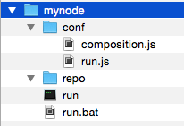

COHORTE system is composed of several Nodes. Only one node is specified to be Top Composer. It manages the components distribution among the available participating nodes.

In this chapter, we will detail how to create and start COHORTE Nodes using simple command lines.

## Creating nodes

To create COHORTE node, you have to use the provided `cohorte-create-node` command.

Note

Ensure to have installed COHORTE on your system and that the COHORTE_HOME environment variable is set to the installation path of COHORTE (see <a href="{{ site.baseurl }}/docs/1.1/setup">setup guide</a>).

### Usage


$ cohorte-create-node [-h] [-n NODE_NAME] [-c COMPOSITION_NAME] [-a APP_ID]


### Arguments

This command has the following arguments :

<pre>
  -h, --help            show this help message and exit

  -n NODE_NAME, --name NODE_NAME
                        Name of the node
  -c COMPOSITION_NAME, --composition-name COMPOSITION_NAME
                        application's composition name
  -a APP_ID, --app-id APP_ID
                        application's ID
</pre>                      

You should at least provide `NODE_NAME` (node name). `COMPOSITION_NAME` is a symbolic name given to your application's composition (set of components of your application that will be instantiated by Cohorte), and the `APP_ID` is you application's secret token that will be shared between the different nodes of your application. You can set it at startup time if you need (see further).

Note

It is the <code>APP_ID</code> which allows the different nodes of your application to be discovered automatically while rejecting other nodes with different specified <code>APP_ID</code>.

### Example


$ cohorte-create-node --name mynode --composition-name myapp_composition --app-id myapp_id


This command will create a directory containing the following structure:

* *mynode* corresponds to the provided name by the user using the `--name` option.
* *run* is the startup script. It will be detailed in the next section (Starting nodes)
* *repo* is a directory where user provided bundles should be placed.
* *conf* is a directory containing configuration files. Only two configuration files are created initially (composition.js and run.js), other files will be generated in this directory when starting the node using the `run` script.

Here is the content of the generated `conf/composition.js`file. You should add component descriptions on the indicated zone (see [Composition Specification](./compositions)).


{
    "name": "myapp_composition",
    "root": {
        "name": "myapp_composition-composition",
        "components": [
            /* your component descriptions here */
        ]
    }
}


Note

<code>composition.js</code> template is generated only when the --composition-name option is set. This is the case of a Top Composer Node which will be responsible for controlling the instantion of component on the different Nodes.  

The generated `conf/run.js` file contain the initial startup arguments. Here is its content :


{
    "cohorte-version": "1.1.0",
    "app-id": "myapp_id",
    "node": {
        "name": "mynode",
        "shell-port": 0,
        "http-port": 0,
        "top-composer": false,
        "console": true
    },
    "transport": [
        "http"
    ],        
    "transport-http": {
        "http-ipv": 6
    }    
}


The next section will give more information about the startup options.

## Starting nodes

To start a COHORTE node, you have to use the generated `run` command (this command calls `cohorte-start-node` internal command).

### Usage

$ ./run [-h] [-a APP_ID]
        [--use-config CONFIG_FILE] [--update-config]
        [--show-config] [-i INTERPRETER]
        [-b BASE_ABSOLUTE_PATH] [-n NODE_NAME]
        [--top-composer IS_TOP_COMPOSER]
        [--composition-file COMPOSITION_FILE]
        [--auto-start AUTO_START] [--http-port HTTP_PORT]
        [--shell-port SHELL_PORT] [--use-cache USE_CACHE]
        [--recomposition-delay RECOMPOSITION_DELAY]
        [--console] [--transport TRANSPORT_MODES]
        [--xmpp-server XMPP_SERVER]
        [--xmpp-port XMPP_PORT]
        [--xmpp-user-jid XMPP_JID]
        [--xmpp-user-password XMPP_PASSWORD]
        [--http-ipv HTTP_IPV]


### Arguments

There are different kind of arguments depending on the use of the actual node.

#### Mandatory options

<pre>
  -a APP_ID, --app-id APP_ID
                        Application's ID
</pre>                      

All the nodes participating for a given application should have the same `APP_ID`. 

#### Startup configuration options

<pre>
  --use-config CONFIG_FILE
                        Configuration file to use for starting cohorte node.
                        By default the conf/run.js file is used if available
  --update-config       Update startup configuration file with provided
                        options
  --show-config         Show startup configuration file content
  
  -i INTERPRETER, --interpreter INTERPRETER
                        Path to Python interpreter to use (python2 or python3)
  -b BASE_ABSOLUTE_PATH, --base BASE_ABSOLUTE_PATH
                        absolute file path of the node's directory
</pre>

We can write the startup configurations in a separate JSON file (see How to use startup configuration files section). This options will simplify the command options list and allows sharing the same startup configurations between several nodes.

#### Information about the node to start

<pre>
  -n NODE_NAME, --node NODE_NAME
                        Node name
  --top-composer IS_TOP_COMPOSER
                        Flag indicating that this node is a Top Composer
  --composition-file COMPOSITION_FILE
                        Composition file (by default 'composition.js'). All
                        composition files should be placed on 'conf' directory
  --auto-start AUTO_START
                        Auto-start the composition if this node is a Top
                        Composer
  --http-port HTTP_PORT
                        Node HTTP port
  --shell-port SHELL_PORT
                        Node Remote Shell port
  --use-cache USE_CACHE
                        Use cache to accelerate startup time (experimental)
  --recomposition-delay RECOMPOSITION_DELAY
                        Delay in seconds between two recomposition tentatives
</pre>

We can provide a different node name than the already provided when the node is created (by using `--node` argument). One important option of cohorte nodes is the `--top-composer`. If set, the node will be considered as a **Top Composer** (manages all the distribution of components among the available nodes). Users can also provide customised informations such as the http port to use for the *web-admin* component (see [monitoring chapter]({{ site.baseurl }}/docs/1.1/monitoring)), or the port to use for the remote *shell-admin* component. 

<pre>
  --transport TRANSPORT_MODES
                        Transport mode (http and/or xmpp - seperated by comma)
</pre>

The `--transport` option allow the user to choose which transport protocol to use between the actual node and the other nodes participating in the same application. You can provide a common seperated list of the supported protocols (`http` and `xmpp` for the moment). Each protocol needs additional configuration options that should be provided seperataly using dedicated options.

HTTP options : 

<pre>
  --http-ipv HTTP_IPV   HTTP IP version to use (4 or 6)    
</pre>

XMPP options :

<pre>
  --xmpp-server XMPP_SERVER
                        XMPP server
  --xmpp-port XMPP_PORT
                        XMPP server port
  --xmpp-user-jid XMPP_JID
                        XMPP User jid (not yet implemented - annonymous mode
                        only)
  --xmpp-user-password XMPP_PASSWORD
                        XMPP User password
</pre>    

If the XMPP server accepts **`anonymous`** connections, you can connect to it without a JID. However, in any cases, the server should accept **multi-user chat**. 

### How to use startup configuration files

To avoid re-typing the same options each time a node is started, or to share the same configuration between several nodes, you can provide a *startup configuration file* which contains such startup configurations. En complet exemple of such file is given hereafter. 

> conf/run.js


{	
    "app-id": "ABCDEF",
    "cohorte-version": "1.1.0",
    "node": {		
        "name": "node-rasp",
        
        "top-composer": true,
        "composition-file" : "composition.js",
        "recomposition-delay": 150,
        "auto-start" : true,
        
        "http-port": 9001,
        "shell-port": 9001,        
        "interpreter" : "python3",
                
        "use-cach" : false        		
    },
    "transport": ["xmpp", "http"],
    "transport-xmpp": {
        "xmpp-server": "charmanson.isandlatech.com",
        "xmpp-user-jid" : "myjid",
        "xmpp-user-password" : "mypassword",
        "xmpp-port": 5222
    },
    "transport-http": {
        "http-ipv" : 6
    }
}


* To show the content of the startup configuration file :


$ ./run --show-config 


* To use other configuration file than the default *run.js* file :


$ ./run --use-config other_run_conf.js


* Update the startup configuration using command options (--some-configuration should be replaced with a supported options list):


$ ./run --update-config --some-configurations 


This will update all the provided options within the startup configuration file (run.js). 

## Connection modes

### Using HTTP


./run --app-id myapplication --transport http 


The discovery is done using TCP multi-caste feature. This limits the scope of the discovered COHORET nodes to only available at a local network area LAN. To deploy you COHORTE nodes at the Internet level, you should use XMPP mode.

### Using XMPP

You need to start the Top Composer with the following at least configurations :


./run --app-id myapplication --transport xmpp \
--xmpp-server server_url \
--xmpp-port 5222 \


### Using HTTP/XMPP

You can use the two transport protocols in the same time. At runtime, only one is used, if it does not work COHORTE choose the other one.

Note

Herald, the framework used as discovery and transport layer in COHORTE, has a generic architecture allowing it to add more discovery and transport protocols. Other connection modes are under development and will be released in future version of COHORTE.

