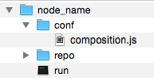

COHORTE system is composed of several Nodes. Only one node is specified to be Top Composer. It manages the components distribution among the available participating nodes.

In this chapter, we will detail how to create and start COHORTE nodes using simple command lines.

## Creating nodes

To create COHORTE node, you have to use the provided `cohorte-create-node` command.

Note

Ensure to have installed COHORTE on your system and that the COHORTE_HOME environment variable is set to the installation path of COHORTE (see <a href="{{ site.baseurl }}/docs/1.x/setup">setup guide</a>).

### Usage


$ ./cohorte-create-node [-h] [-n NODE_NAME] [-a APP_NAME]


### Options

This command has the following options :

<pre>
  -h, --help            show this help message and exit

  -n NODE_NAME, --name NODE_NAME
                        Name of the node
  -a APP_NAME, --app-name APP_NAME
                        application's symbolic name
</pre>                      

### Results

This command will create a directory containing the following structure:

* *node_name* correspond to the provided name by the user using the `--name` option.
* *run* is the starting script. It will be detail in the next section (Starting nodes)
* *repo* is a directory where user provided bundles should be placed.
* *conf* is a directory containing configuration files. Only one configuration file is created initially (composition.js), other files are generated by `run` script in this location.

Here is the content of the generated `conf/composition.js`file. You should add component descriptions on the indicated zone (see [Composition Specification]({{ site.baseurl }}/docs/1.x/compositions)).


{ 
  "name": "default-application",
  "root": {
    "name": "default-application-composition",
    "components": [
      /* your component descriptions here */
    ]
  }
}


Only the node started as Top Composer (see next section) should have this configuration file completed. Other nodes started as simple nodes will ignore this file.

Note

composition.js template is generated only when the --app-name option is set. 

## Starting nodes

To start a COHORTE node, you have to use the generated `run` command (this command calls `cohorte-start-node` internal command).

### Usage

$ ./run [-h] [-a APPLICATION_ID]
        [--use-config CONFIG_FILE] [--update-config]
        [--show-config] [-b BASE_ABSOLUTE_PATH]
        [-n NODE_NAME] [--top-composer IS_TOP_COMPOSER]
        [--data-dir DATA_DIR]
        [--composition-file COMPOSITION_FILE]
        [--auto-start AUTO_START]
        [--web-admin WEB_ADMIN_PORT]
        [--shell-admin SHELL_ADMIN_PORT]
        [--transport TRANSPORT_MODES]
        [--xmpp-server XMPP_SERVER]
        [--xmpp-port XMPP_PORT]
        [--http-ipv HTTP_IPV]


### Options

There are different kind of options depending on the use of the actual node.

#### Mandatory options

<pre>
  -a APPLICATION_ID, --app-id APPLICATION_ID
                        Application's ID
</pre>                      

All the nodes participating for a given application should have the same `APPLICATION_ID`. 

#### Startup configuration options

<pre>
  --use-config CONFIG_FILE  Configuration file to use for starting cohorte node.
                        By default the run.js file is used if available
  --update-config       Update startup configuration file with provided
                        options
  --show-config         Show startup configuration file content
  -i INTERPRETER, --interpreter INTERPRETER
                        Path to Python interpreter to use (python2 or python3)
  -b BASE_ABSOLUTE_PATH, --base BASE_ABSOLUTE_PATH
                        absolute file path of the node's directory
</pre>

We can write the startup configurations in a separate JSON file (see How to use startup configuration files section). This options will simplify the command options list and allows sharing the same startup configurations between several nodes.

#### Information about the node to start

<pre>
  -n NODE_NAME, --node NODE_NAME
                        Node name
  --data-dir NODE_DATA_DIR
                        Node Data Dir
  --top-composer IS_TOP_COMPOSER
                        Flag indicating that this node is a Top Composer
  --composition-file COMPOSITION_FILE
                        Composition file (by default 'composition.js'). All
                        composition files should be placed on 'conf' directory
  --auto-start AUTO_START
                        Auto-start the composition if this node is a Top
                        Composer
  --http-port HTTP_PORT
                        Node HTTP port
  --shell-port SHELL_PORT
                        Node Remote Shell port
  --use-cache USE_CACHE
                        Use cache to accelerate startup time (experimental)
  --recomposition-delay RECOMPOSITION_DELAY
                        Delay in seconds between two recomposition tentatives

</pre>

We can provide a different node name than the already provided when the node is created (by using --node option). One important option of cohorte nodes is the `--top-composer`. If set, the node will be considered as a **Top Composer** (manages all the distribution of components among the available nodes). Users can also provide customised informations such as the http port to use for the *web-admin* component (see [monitoring chapter]({{ site.baseurl }}/docs/1.x/monitoring)), or the port to use for the remote shell admin component. 

####  Information about the transport protocols to use
<pre>
  --transport TRANSPORT_MODES
                        Transport mode (http and/or xmpp - seperated by comma)
  --xmpp-server XMPP_SERVER
                        XMPP server
  --xmpp-port XMPP_PORT
                        XMPP server port
  --xmpp-user-jid XMPP_JID
                        XMPP User jid (not yet implemented - annonymous mode
                        only)
  --xmpp-user-password XMPP_PASSWORD
                        XMPP User password
  --http-ipv HTTP_IPV   HTTP IP version to use (4 or 6)
</pre>

The `--transport` option allow the use to choose which transport protocol to use between the actual node and the other nodes participating in the same application. You can provide a common seperated list of the supported protocols (`http` and `xmpp` for the moment). Each protocol need additional configuration options that should be provided seperataly using dedicated options (--xmpp-server for instance to mention the XMPP server to use).

### How to use startup configuration files

To avoid re-typing the same options each time a node is started, or to share the same configuration between several nodes, you can provide a *startup configuration file* which contains such startup configurations. The content of such file is described hereafter. 

> run.js


{	
	"application-id": "ABCDEF",

	"node": {		
		"name": "node-rasp",
		"top-composer": true,
		"web-admin": 9001,
		"shell-admin": 9001		
	},
	"transport": ["xmpp"],
	"transport-xmpp": {
		"xmpp-server": "charmanson.isandlatech.com",
		"xmpp-port": 5222
	}
}


* To show the content of the startup configuration file :


$ ./run --show-config 


* To use other configuration file than the default *run.js* file :


$ ./run --use-config other_run_conf.js


* Update the startup configuration using command options (--some-configuration should be replaced with a supported options list):


$ ./run --update-config --some-configurations 


This will update all the provided options within the startup configuration file (run.js). 

## Connection modes

### Using HTTP


./run --app-id myapplication --transport http 


The discovery is done using TCP multi-caste feature. This limits the scope of the discovered COHORET nodes to only available at a local network area LAN. To deploy you COHORTE nodes at the Internet level, you should use XMPP mode.

### Using XMPP

You need to start the Top Composer with the following configurations :


./run --app-id myapplication --transport xmpp \
--xmpp-server server_url \
--xmpp-port 5222 \


The XMPP server should accept **`anonymous`** connections and **`multi-user chat**. 

### Using HTTP/XMPP

You can use the two transport protocols in the same time. At runtime, only one is used, if it does not work COHORTE choose the other one.

Note

Herald, the framework used as discovery and transport layer in COHORTE, has a generic architecture allowing it to add more discovery and transport protocols. Other connection modes are under development and will be released in future version of COHORTE.

