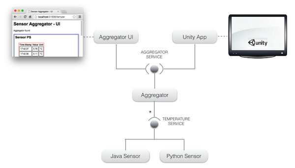
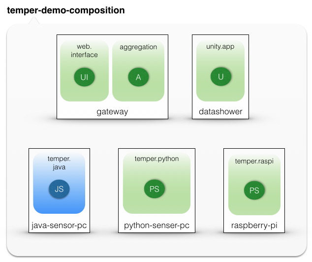
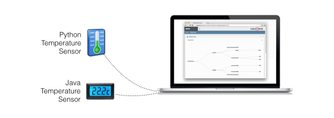
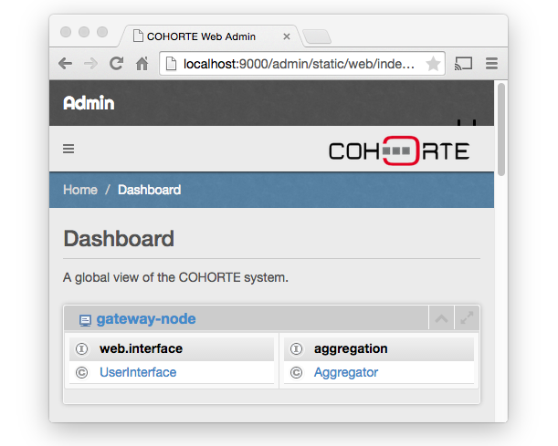
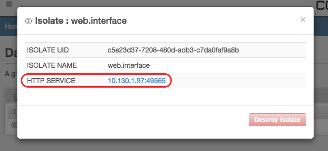
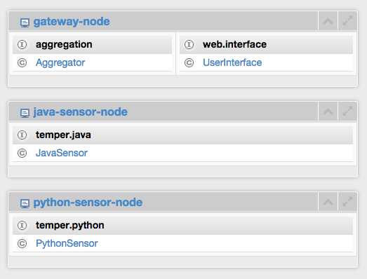
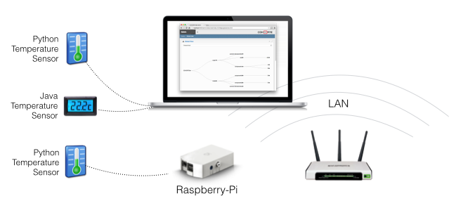
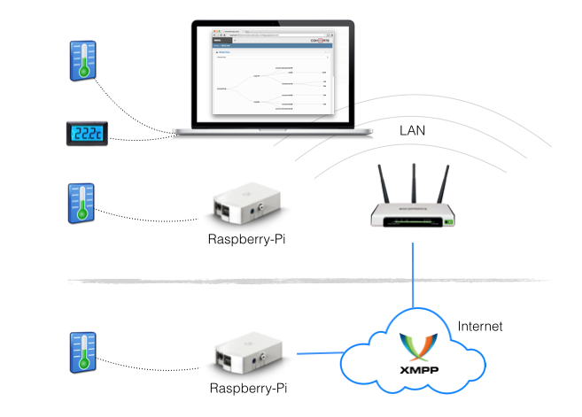
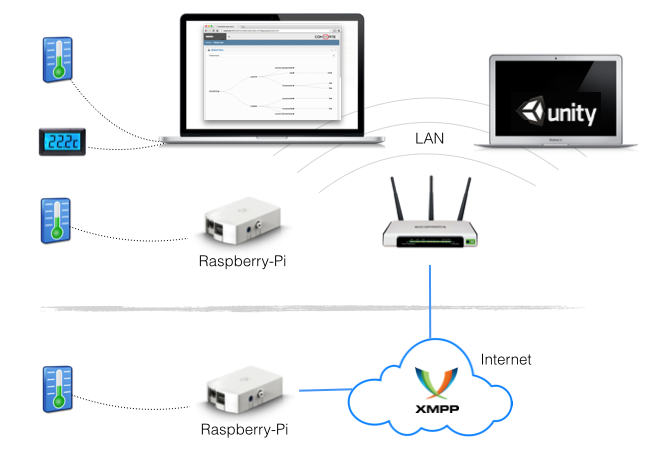
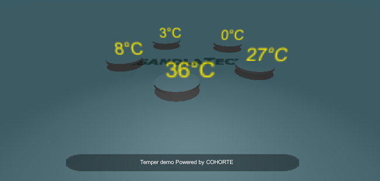

In this tutorial we will have a complete working temperature aggregation application with different type of components and deployment devices.

Let's first talk about the application's architecture.

## Application

The *temper* application has a *service-oriented architecture SOA* composed of components and services depicted in the following picture:

There are two services:

* **TEMPERATURE SERVICE**: this is the interface for all temperature sensor devices. Users can implement it in Python or Java while respecting the provided interface. It has three methods:
  * `get_name`: retrieves the name of the sensor.
  * `get_unit`: retrieves the values unit name.
  * `get_value`: retrieves the current value of the sensor.

* **AGGREGATOR SERVICE**: collects the temperature of the connected sensors (using the TEMPERATURE SERVIC) and stock them locally. The stocked information is used by third-party visualisation interfaces (*web interface* or *Unity 3D interface*) using the following methods:
  * `get_history`: retrieves the whole known history as a dictionary.
  * `get_sensor_history`: retrieves the known history for the given sensor.
  * `get_sensors`: retrieves the list of sensors visible in the history.
  * `get_active_sensors`: retrieves the list of active sensors.

## Deployment and runtime configuration

Now, its time to manage the deployment of these components. In this use case, we can have different type of execution machines:

* **gateway-node** : any personal computer or integrated homebox that can hosts and runs the *aggregator* component as well as the *web interface* component.
* **java-sensor-node** : any personal computer that can hosts and runs  Java sensor components.
* **python-sensor-node** : any personal computer that can hosts and runs Python sensor components.
* **raspberry-node** : any Raspberry-Pi device that can hosts and runs Python sensor component.
* **datashower-node** : any personal computer that can hosts and runs the *Unity 3D engine*. 

COHORTE provides a [*composition language*]({{ site.baseurl }}/docs/1.x/compositions) which helps administrators fixing some rules concerning the deployment and instantiation of application components. 

The following picture depicts the graphical notation of the resulting specification for this use case:

Legend:

* **JS**: Java temperature Sensor
* **PC**: Python temperature Sensor
* **A**: temperature Aggregator 
* **UI**: web User Interface
* **U**: Unity 3D interface 

`gateway-node/conf/composition.js` file ([view it here](composition.html)) represents the JSON equivalent for this deployment and composition specification.

## COHORTE Nodes

We have created and prepared the different COHORTE nodes for each of the targeted devices. Each node contains the necessary bundles deployed on the `repo` directory and configuration files on the `conf` directory.

<a id="download_temper_snapshot" href="#" class="btn btn-success">Download Temper Nodes</a>

Extract the downloaded zip file somewhere in your file system. You can try the different nodes in the same machine or distribute them in different machines.

Ensure to have COHORTE installed on your system. If not the case, refer to the [downloads]({{ site.baseurl }}/downloads) page to get the latest available version and to the [setup documentation]({{ site.baseurl }}/docs/1.x/setup) for installation details. 

## Demonstrations

In the next steps, we will use the nodes to execute our application. For clarity, we will proceed the execution of the temper application following these steps : 

* **[STEP 1](#step1)** : in the same machine, we start three COHORTE nodes (*gateway*, *java-sensor-node*, and *python-sensor-node*). We monitor the application's architecture to see the automatically created isolates and their components.   
* **[STEP 2](#step2)** : we start a Raspberry-Pi device containing the *raspberry-pi* COHORTE node. We highlight the dynamic capabilities of COHORTE and its remote-services feature.
* **[STEP 3](#step3)** : at this step, we start another machine containing the *datashower* COHORET node. We highlight the capability of COHORTE to deal with different components implemented in different languages (here C#).

<!-- 

* **[STEP 4](#step4)** : at the final step, we will implement our specific temperature sensor (using Java) and add it to our application. 

-->

### Components Isolation and multi-language implementations

At this first step, we highlight the multi-language components implementation supported by COHORTE. In our described application in section 1, the Hello Service is implemented in Python and in Java. In this demonstration we will show you how COHORTE manage to have the same runtime infrastructure for either Java or Python implementations. We see also how COHORTE creates Isolates as described in the *composition specification* (and as responds to runtime crashes). 

At a first step, we try to launch in one machine two temperature sensors implemented in different programming languages (as shown in the following picture). We starts also the aggregation component and the web user interface to check the collected data. 

To accomplish this requirement and following the composition specification, we need to start these three COHORTE nodes in one machine :

* **gateway-node** (as Top Composer) : instantiates the aggragator and web user interface components
* **python-sensor-node** : instantiates Python temperature sensor component
* **java-sensor-node** : instantiates Java temperature sensor component

All the components follow the Service-Oriented Architecture (SOA) detailed in the first section of this chapter. 
 
#### Starting the gateway (aggregator and web interface components)

Go to the downloaded `gateway-node` directory and type the following command to start it as a Top Composer : 

<pre>
$ ./<b>run</b> --app-id temper --top-composer true 
</pre>

* `--app-id` is required to identify the current application's execution and so as other COHORTE nodes can join it. 
* `--top-composer` set the current COHORTE node to be Top Composer. It will be responsible for dispatching the components among the available nodes following the *composition specification* already provided on `gateway-node/conf/composition.js`.
* This node will also be started using other startup configurations provided in `gateway-node/run.js` file :


{
    "node": {                
        "name": "gateway-node",           
        "composition-file": "composition.js",
        "web-admin": 9000,     
        "shell-admin": 9001
    },
    "transport": [
        "http"
    ]
}


Accordingly, this node will use HTTP connection mode. The discovery of other COHORTE nodes will be carried out using Multicast over TCP/IP. Communication between nodes will be ensured using TCP/IP sockets. This limits the scope of the participating COHORTE nodes to local network area.

Other important configurations are the `web-admin` and `shell-admin` ports. The latter is used to remotely access the shell of this node (e.g., `nc localhost 9001`), while the former is used to access the Web Admin interface in a web browser using this address : `http://localhost:9000/admin`

You notice that there is only one COHORTE node at this time (**gateway-node**), which contains two *isolates* (**web.interface** and **aggregation**) as specified in the *composition specification*.  

To Open the web interface provided by the **UserInterface** component, click on its isolate (*web.interface*) to see details about it, then click on the HTTP SERVICE link to open new browser tab referring to the HTTP server of the *web.interface* isolate. You have to add `/temper` to access the **UserInterface** component's provided interface.

#### Starting temperature sensors

While the **aggregator** and the **aggregator web interface** are running, we start now the two Java and Python implemented sensors. 

* Go the `python-sensor-node` and `java-sensor-node` directory in two separate terminals and type the following command for each one (ensure to set the same `--app-id` as the Top Composer started before):

<pre>
$ ./<b>run</b> --app-id temper  
</pre>

This command will start the corresponding node and participate to the global application. In particular, the Top Composer started before (and which have the *composition specification file*) will order these nodes to instantiate sensor components corresponding to their nature. Hence, in the **python-sensor-node** we will have an instance of the component **python-sensor-factory** and in the **java-sensor-node** will will have another instance of **java-sensor-factory** component.

Check the *aggregator web interface*, you will notice new two columns for Python and Java sensors.

All this three COHORTE nodes are located on the same machine. Let now integrate a new node which runs on separate machine located either in the local network area or somewhere in the Internet.

### Distributed Application

#### Local Network Area deployment

Let's add another different device to our application. In the downloaded zip file, there is a pre-prepared COHORTE node called `raspberry-node`. If you have a *Raspberry-Pi* device, install *Cohorte Python distribution* and put this node on it. Otherwise, you can test this node in any other device (including the one you are already working on).

Go to the `raspberry-node` and start it using the following command :

<pre>
$ ./<b>run</b> --app-id temper
</pre>

You will notice its appearance in the Web Admin, as well as on the Aggregator web interface.

#### Internet level deployment

In order to get your application deployed in the Internet level, you should start the Top Composer in XMPP mode. We will use an XMPP server as transport and discovery middleware. 

* Stop all your running nodes and restart the Top Composer as follow :

<pre>
$ ./<b>run</b> --app-id temper --top-composer true  --use-config run_xmpp.js
</pre>

This will run the Top Composer using the two communication modes : HTTP and XMPP as provided on `run_xmpp.js` startup configuration file :


{
    "node": {
        "name": "gateway-node",
        "top-composer": true,
        "composition-file": "composition.js",
        "auto-start": true,
        "web-admin": 9000,
        "shell-admin": 9001     
    },
    "transport": [
        "xmpp",
        "http"
    ],
    "transport-xmpp": {
        "xmpp-port": 5222,
        "xmpp-password": "Bender",
        "xmpp-jid": "bot@charmanson.isandlatech.com",
        "xmpp-server": "charmanson.isandlatech.com"
    }
}


* start again the previous nodes as before, they will use HTTP communication mode as they are located on the local network area. 
* start a new `raspberry-node` node using the following command : 

<pre>
$ ./<b>run</b> --app-id temper --node remote_raspberry --use-config run_xmpp.js
</pre>

This last node called at runtime `remote_raspberry` could be placed any where the time he has access to the configured XMPP server (see run_xmpp.js).

### .Net interaction via Unity 3D framework

Now it's time to add the 3D viewer of our temperature sensors. 

Download the already implemented viewer corresponds to your platform :

<ul>
  <li><a href="#">Mac OS X</a></li>
  <li><a href="#">Linux</a></li>
  <li><a href="#">Windows</a></li>
</ul>

The downloaded zip file corresponds to a static COHORTE node. No composition will be ordered from the Top Composer, the local component will be instantiated at startup by the node itself.

At startup, you have to give the application's ID specified for the Top Composer (`temper`) and the 3D viewer will reflect automatically the detected temperature sensors and their collected last value.

The unity is a .Net application. We have integrated C# components in COHORTE so that will be considered as (remote) services.

<!--

### Implementing a new temperature sensor component

Work in progress..

-->

